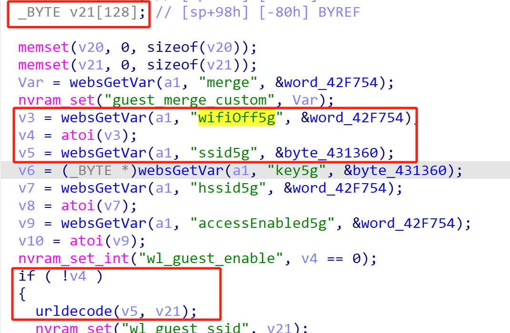
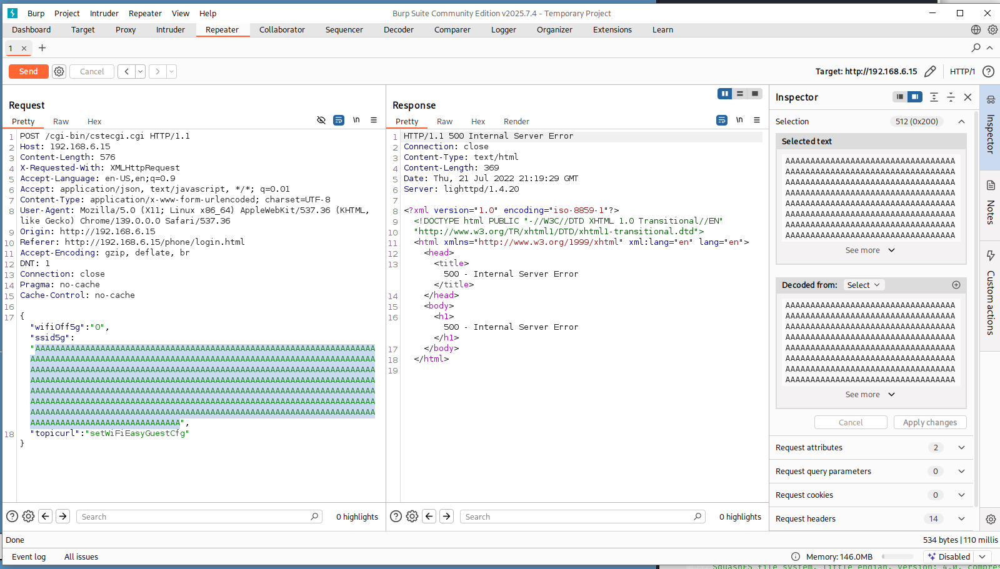

# TOTOLink Vulnerability

Vendor:TOTOLink 

Product:A7000R

Version:V9.1.0u.6115_B20201022(https://www.totolink.net/home/menu/detail/menu_listtpl/download/id/171/ids/36.html)

Vulnerability Type: Stack Overflow

Author:Shuhao Shen

## Vulnerability cause

In the `sub_4222E0` function, the `ssid5g` parameter is obtained via `websGetVar` and passed to the `urldecode` function for decoding. The `urldecode` function stores the decoded input in the target buffer `v21`, but does not restrict the length of the input `v5` (i.e., `ssid5g`). The `urldecode` function uses a pointer `v3` (pointing to `v21`) to write decoded data byte by byte, with `v4` (a counter) controlling the position of the null terminator, ultimately writing a null character at `a2[v4 - 1] = 0`. The buffer `v21` is a fixed-size array (`_BYTE v21[128]`), and the condition `if (!v4)` can be controlled by the `wifiOff5g` parameter. When `ssid5g` is excessively long and `wifiOff5g` is set to `0`, `urldecode` can trigger a buffer overflow, overwriting adjacent stack data or the return address, resulting in a Denial of Service (DoS) attack.

## Result

The target router crashes and cannot provide services correctly and persistently.

