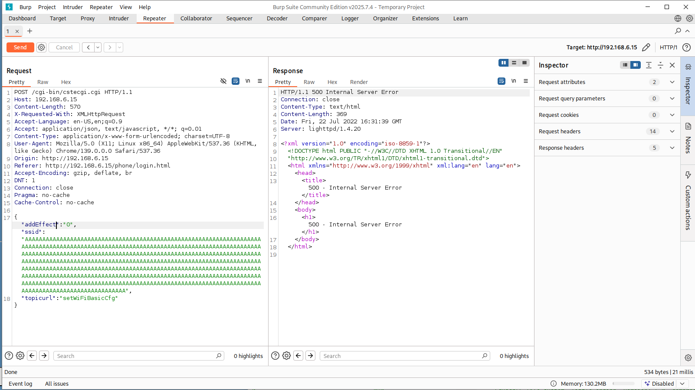

# TOTOLink Vulnerability

Vendor:TOTOLink 

Product:A7000R

Version:V9.1.0u.6115_B20201022(https://www.totolink.net/home/menu/detail/menu_listtpl/download/id/171/ids/36.html)

Vulnerability Type: Stack Overflow

Author:Chuanhao Wan

## Vulnerability cause

In the sub_421CF0 function, the ssid parameter is obtained via websGetVar(a1, "ssid", &byte_431360) and, when the addEffect parameter is "0", passed to the urldecode function for decoding. The urldecode function stores the decoded input in the target buffer v19, but does not restrict the length of the input v7 (i.e., ssid). The urldecode function uses a pointer v3 (pointing to v19) to write decoded data byte by byte, with v4 (a counter) controlling the position of the null terminator, ultimately writing a null character at a2[v4 - 1] = 0. The target buffer v19 is a fixed-size array (_BYTE v19[128]), and the condition if (atoi(v4)) can be controlled by the addEffect parameter. When the ssid parameter is excessively long and addEffect is set to "0", urldecode can trigger a buffer overflow, overwriting adjacent stack data or the return address, resulting in a Denial of Service (DoS) attack.

## Result

The target router crashes and cannot provide services correctly and persistently.

