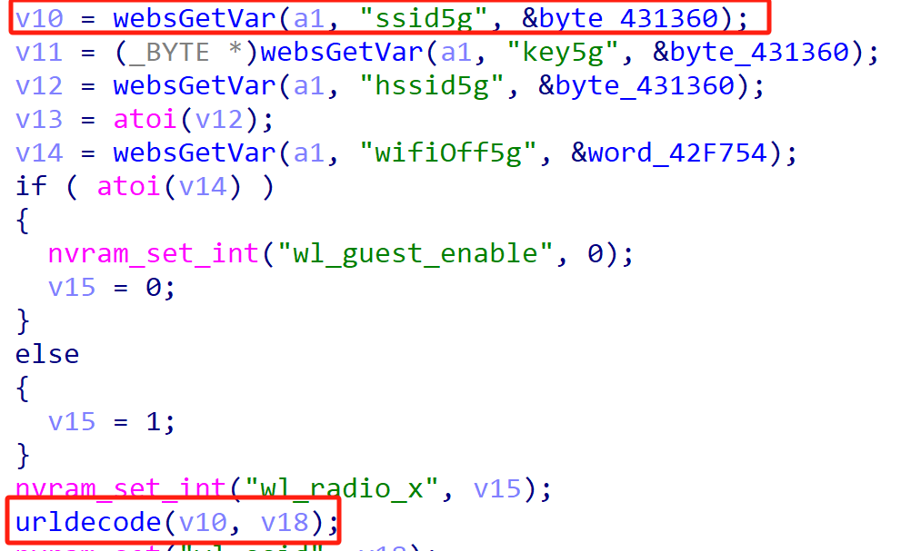
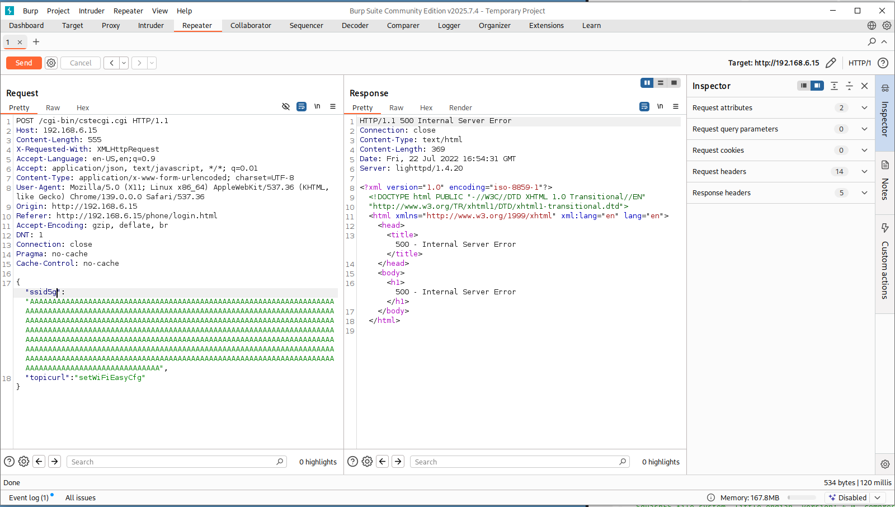

# TOTOLink Vulnerability

Vendor:TOTOLink 

Product:A7000R

Version:V9.1.0u.6115_B20201022(https://www.totolink.net/home/menu/detail/menu_listtpl/download/id/171/ids/36.html)

Vulnerability Type: Stack Overflow

Author:Shuhao Shen

## Vulnerability cause

In the target function, the ssid5g parameter is obtained via websGetVar(a1, "ssid5g", &byte_431360) and passed to the urldecode function for decoding. The urldecode function stores the decoded input in the target buffer v18, but does not restrict the length of the input v10 (i.e., ssid5g). The urldecode function uses a pointer v3 (pointing to v18) to write decoded data byte by byte, with v4 (a counter) controlling the position of the null terminator, ultimately writing a null character at a2[v4 - 1] = 0. The target buffer v18 is a fixed-size array (_BYTE v18[132], based on context assumption), and the call to urldecode(v10, v18) is executed unconditionally. When the ssid5g parameter is excessively long, urldecode can trigger a buffer overflow, overwriting adjacent stack data or the return address, resulting in a Denial of Service (DoS) attack.

## Result

The target router crashes and cannot provide services correctly and persistently.

