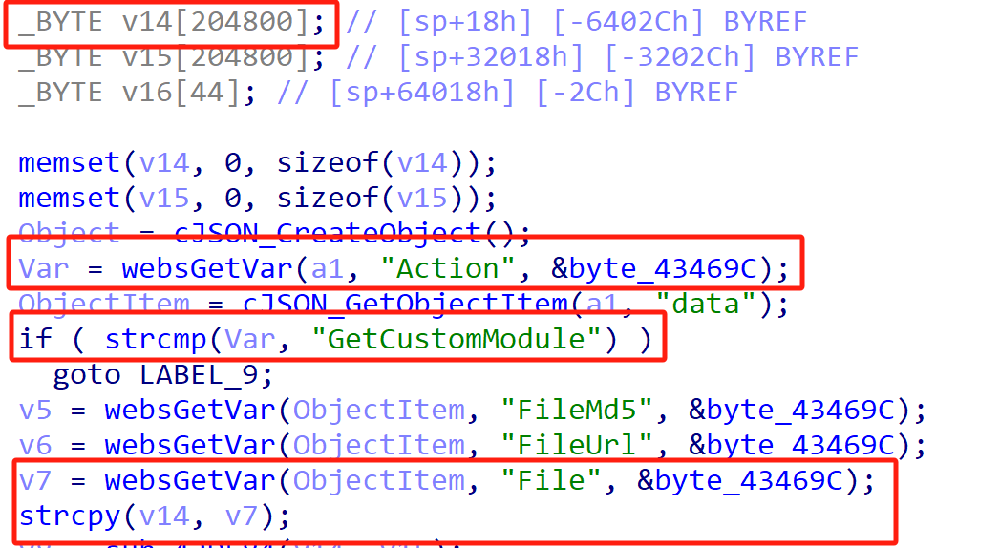

# TOTOLink Vulnerability

Vendor:TOTOLink 

Product:T8

Version:V4.1.5cu.862_B20230228(https://www.totolink.net/home/menu/detail/menu_listtpl/download/id/222/ids/36.html)

Vulnerability Type: Stack Overflow

Author:Chuanhao Wan

## Vulnerability cause

In the sub_422714 function, the File parameter is obtained via websGetVar(ObjectItem, "File", &byte_43469C) and passed to the strcpy function, copying to the target buffer v14. The strcpy function does not restrict the length of the input v7 (i.e., File), and the target buffer v14 is a fixed-size array (_BYTE v14[204800]). When the Action parameter is "GetCustomModule" and the File parameter is excessively long, strcpy(v14, v7) can trigger a buffer overflow, overwriting adjacent stack data or the return address, resulting in a Denial of Service (DoS) attack.

## Result

The target router crashes and cannot provide services correctly and persistently.

