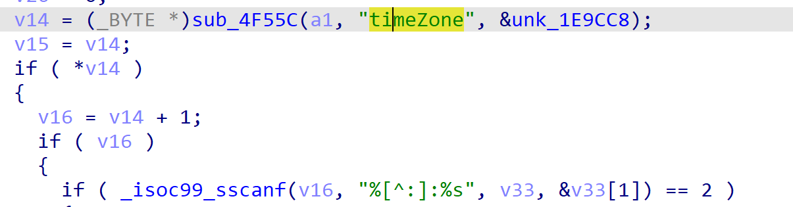
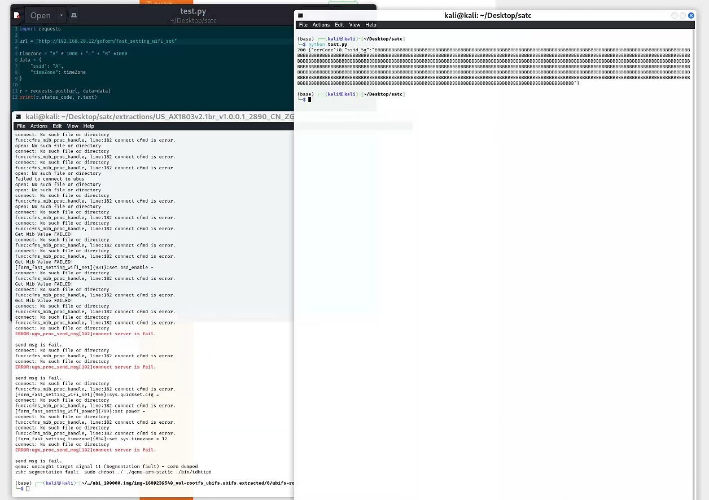

# Tenda Vulnerability

Vendor:Tenda

Product:AX-1803

Version:v1.0.0.1(https://www.tenda.com.cn/download/detail-3421.html)

Vulnerability Type: Stack Overflow

Author:Shuhao Shen

## Vulnerability cause

In the form_fast_setting_wifi_set function processing the timeZone parameter, the timeZone is obtained via sub_4F55C and passed to _isoc99_sscanf, parsed with the format "%[^:]:%s" into the target buffers v33 and &v33[1]. The code does not restrict the length of the timeZone parameter, and the "%s" format specifier does not specify a maximum field width, while the buffer v33 has a limited size. By crafting a request with an excessively long timeZone parameter (including a colon to pass parsing), a stack overflow can be triggered, resulting in a Denial of Service (DoS) attack.

## Result

The target router crashes and cannot provide services correctly and persistently.

