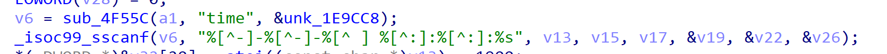

# Tenda Vulnerability

Vendor:Tenda

Product:AX-1803

Version:v1.0.0.1(https://www.tenda.com.cn/download/detail-3421.html)

Vulnerability Type: Stack Overflow

Author:Chuanhao Wan

## Vulnerability cause

In the function processing the time parameter, the time is obtained via sub_4F55C and passed to _isoc99_sscanf, parsed with the format "%[^-]-%[^-]-%[^ ] %[^:]:%[^:]:%s" into the target buffers v13, v15, v17, v19, v22, and v26. The code does not restrict the length of the time parameter, and the "%s" format specifier does not specify a maximum field width, while the target buffer has a limited size. By crafting a request with an excessively long time parameter (matching the specified format), a stack overflow can be triggered, resulting in a Denial of Service (DoS) attack.

## Result

The target router crashes and cannot provide services correctly and persistently.

