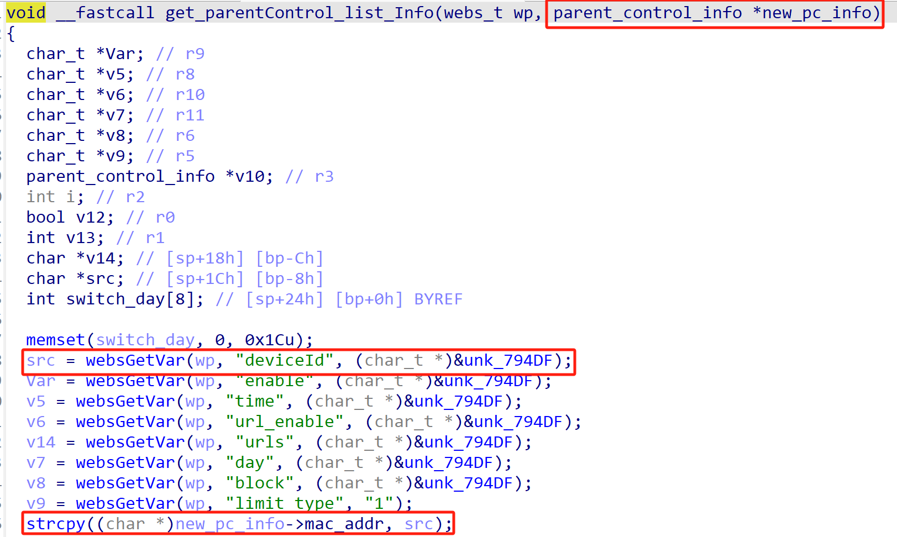
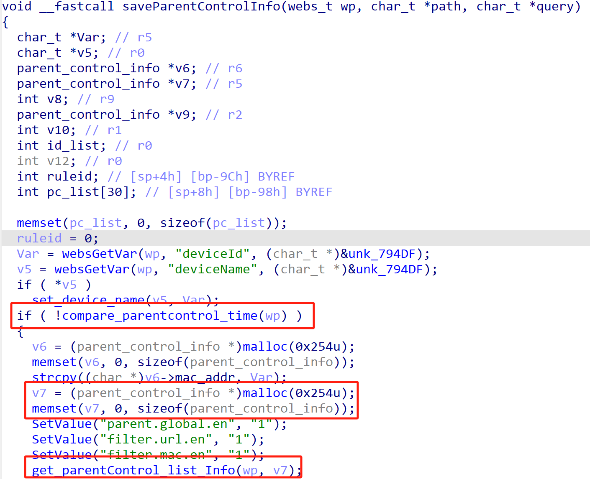
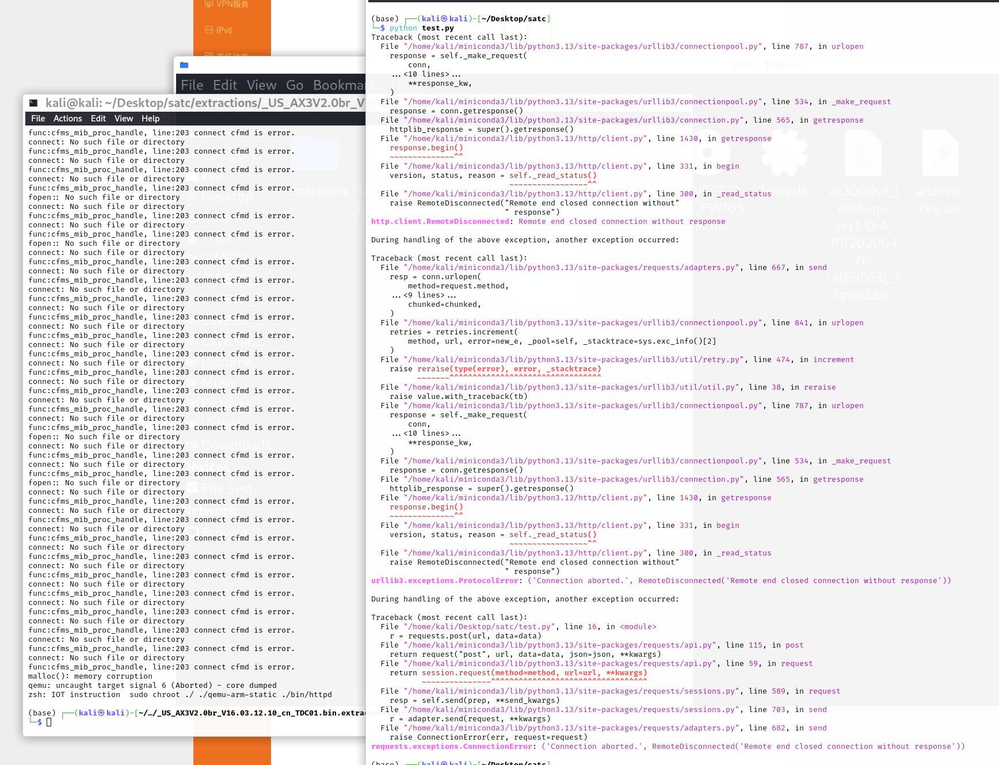

# Tenda Vulnerability

Vendor:Tenda

Product:AX-3

Version:v16.03.12.10_CN(https://www.tenda.com.cn/material/show/3238)

Vulnerability Type: Stack Overflow

Author:Shuhao Shen

## Vulnerability cause

In the get_parentControl_list_Info function, the deviceId parameter is propagated to the strcpy function without any length restriction on the deviceId parameter. The buffer size of the target parameter new_pc_info is derived from the parent function's parameter v7, with a size of 0x254u. By crafting a request that passes the compare_parentcontrol_time check, this can lead to a stack overflow, resulting in a Denial of Service (DoS) attack.

## Result

The target router crashes and cannot provide services correctly and persistently.

