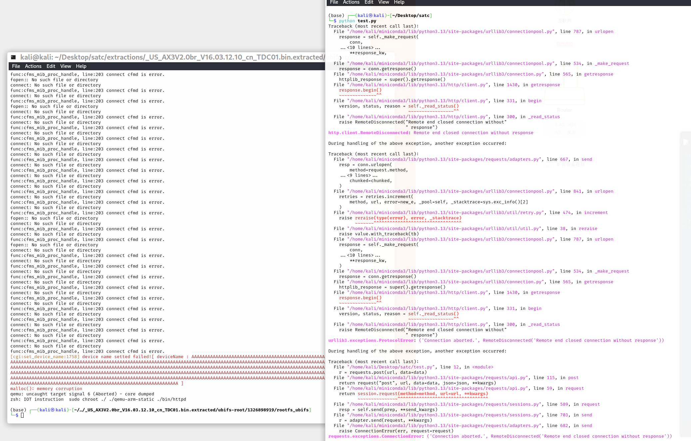
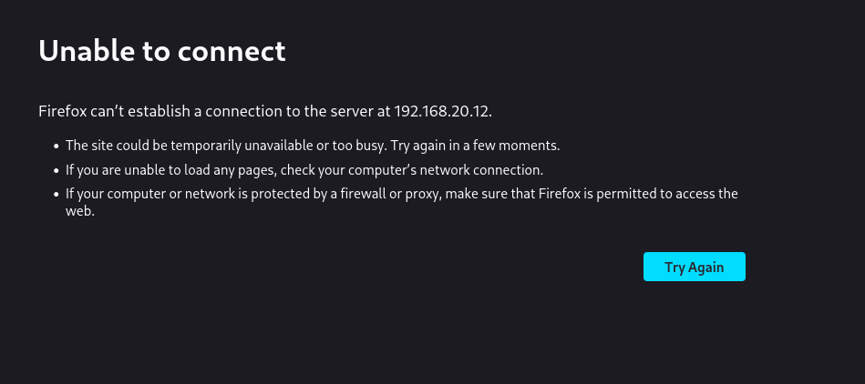

# Tenda Vulnerability

Vendor:Tenda

Product:AX-3

Version:v16.03.12.10_CN(https://www.tenda.com.cn/material/show/3238)

Vulnerability Type: Stack Overflow

Author:Chuanhao Wan

## Vulnerability cause

In the saveParentControlInfo function, the deviceId parameter is obtained via websGetVar and propagated to the strcpy function. The strcpy function does not restrict the length of the deviceId parameter, and the target buffer size is 0x254u. By crafting a request with an excessively long deviceId parameter and a valid time parameter that passes the compare_parentcontrol_time check, a heap or stack overflow can be triggered, resulting in a Denial of Service (DoS) attack.

## Result

The target router crashes and cannot provide services correctly and persistently.

