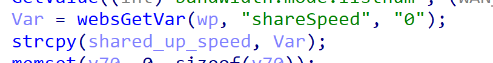
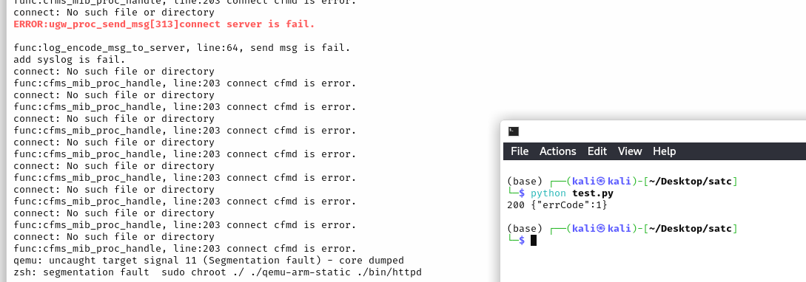
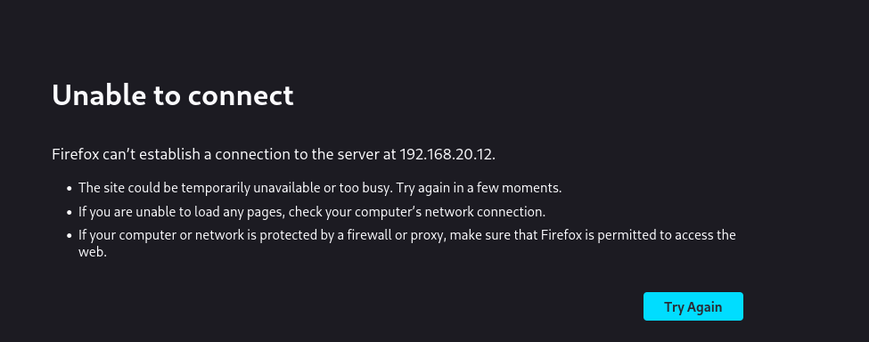

# Tenda Vulnerability

Vendor:Tenda

Product:AX-3

Version:v16.03.12.10_CN(https://www.tenda.com.cn/material/show/3238)

Vulnerability Type: Stack Overflow

Author:Shuhao Shen

## Vulnerability cause

In the fromSetWifiGusetBasic function, the shareSpeed parameter is obtained via websGetVar and propagated to the strcpy function. The strcpy function does not restrict the length of the shareSpeed parameter, and the target buffer size is 16 bytes. By crafting a request with an excessively long shareSpeed parameter, a heap or stack overflow can be triggered, resulting in a Denial of Service (DoS) attack.

## Result

The target router crashes and cannot provide services correctly and persistently.

